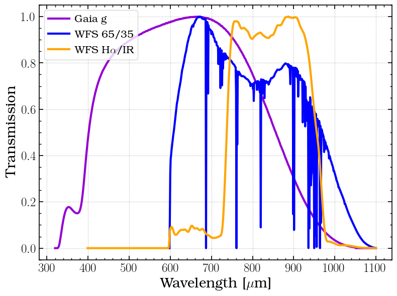
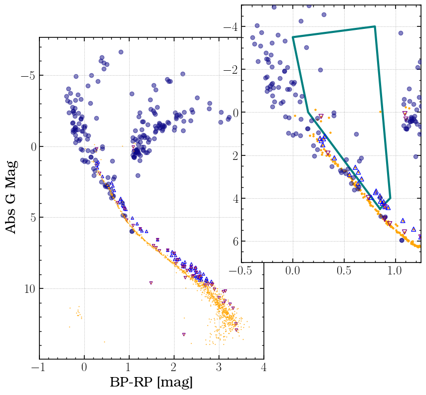
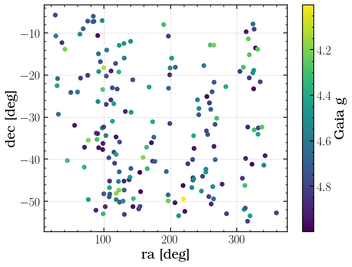

# How Bright Stars Were Selected

I first performed a Gaia ADQL query to select bright stars within a dec range with RUWE < 1.2. This RUWE cut does not guarantee single stars since it only probes a subset of binary separation/luminosity ratio space (see El-Badry et al. 2024 Fig 1), but it will decrease the number likely to be on the edge of resolved and look blob-y on sky.

# Query
Query all objects in Gaia with continuous spectra, low RUWE, and within 15 deg of LCO declination. Include only one with continuous spectra to enable converying the Gaia spectra into WFS magnitudes.

I ran this query on the Gaia archive ADQL interface (because python TAP queries have a 2000 source limit). 


```python
query_input = """SELECT source_id, ra, dec, pmra, pmdec, phot_g_mean_mag, bp_rp, ruwe, has_xp_continuous
                FROM gaiadr3.gaia_source WHERE
                has_xp_continuous = 'True' AND
                dec < -5 AND dec > -55 AND
                phot_g_mean_mag < 5 AND
                RUWE < 1.2
                """

#from astroquery.gaia import Gaia
#job = Gaia.launch_job(query_input)
#r = job.get_results()

#### Load results from Gaia archive ADQL interface. 
r = pd.read_csv('1730739299568O-result.csv', dtype ={'source_id':str})
r
```


<div>
<style scoped>
    .dataframe tbody tr th:only-of-type {
        vertical-align: middle;
    }

    .dataframe tbody tr th {
        vertical-align: top;
    }

    .dataframe thead th {
        text-align: right;
    }
</style>
<table border="1" class="dataframe">
  <thead>
    <tr style="text-align: right;">
      <th></th>
      <th>source_id</th>
      <th>ra</th>
      <th>dec</th>
      <th>pmra</th>
      <th>pmdec</th>
      <th>parallax</th>
      <th>phot_g_mean_mag</th>
      <th>bp_rp</th>
      <th>ruwe</th>
      <th>has_xp_continuous</th>
    </tr>
  </thead>
  <tbody>
    <tr>
      <th>0</th>
      <td>5899408305748518528</td>
      <td>219.471578</td>
      <td>-49.425958</td>
      <td>-28.920706</td>
      <td>-29.213251</td>
      <td>9.348442</td>
      <td>4.001947</td>
      <td>-0.190720</td>
      <td>1.141235</td>
      <td>True</td>
    </tr>
    <tr>
      <th>1</th>
      <td>2940472157174944128</td>
      <td>99.472556</td>
      <td>-18.237520</td>
      <td>-7.165916</td>
      <td>-8.777130</td>
      <td>6.787632</td>
      <td>4.103014</td>
      <td>1.312503</td>
      <td>1.031607</td>
      <td>True</td>
    </tr>
    <tr>
      <th>2</th>
      <td>5518235833732209536</td>
      <td>118.325618</td>
      <td>-48.102908</td>
      <td>-5.679107</td>
      <td>6.162858</td>
      <td>1.528783</td>
      <td>4.174099</td>
      <td>-0.184238</td>
      <td>1.048019</td>
      <td>True</td>
    </tr>
    <tr>
      <th>3</th>
      <td>5440991156144997504</td>
      <td>158.803364</td>
      <td>-39.562578</td>
      <td>-31.504189</td>
      <td>2.619350</td>
      <td>3.615400</td>
      <td>4.187924</td>
      <td>2.791997</td>
      <td>1.030684</td>
      <td>True</td>
    </tr>
    <tr>
      <th>4</th>
      <td>4825052919883631616</td>
      <td>76.102363</td>
      <td>-35.483166</td>
      <td>125.971691</td>
      <td>-42.909247</td>
      <td>17.591152</td>
      <td>4.194447</td>
      <td>1.369841</td>
      <td>1.109602</td>
      <td>True</td>
    </tr>
    <tr>
      <th>...</th>
      <td>...</td>
      <td>...</td>
      <td>...</td>
      <td>...</td>
      <td>...</td>
      <td>...</td>
      <td>...</td>
      <td>...</td>
      <td>...</td>
      <td>...</td>
    </tr>
    <tr>
      <th>188</th>
      <td>6816586167927675776</td>
      <td>325.503348</td>
      <td>-23.263280</td>
      <td>91.684025</td>
      <td>-95.142902</td>
      <td>13.485332</td>
      <td>4.984811</td>
      <td>1.128248</td>
      <td>0.939557</td>
      <td>True</td>
    </tr>
    <tr>
      <th>189</th>
      <td>4112977922408078848</td>
      <td>254.990472</td>
      <td>-25.092270</td>
      <td>5.211071</td>
      <td>-15.899578</td>
      <td>6.048476</td>
      <td>4.991735</td>
      <td>2.204937</td>
      <td>1.086619</td>
      <td>True</td>
    </tr>
    <tr>
      <th>190</th>
      <td>3011410242215060224</td>
      <td>89.768015</td>
      <td>-9.558458</td>
      <td>9.575414</td>
      <td>-46.119938</td>
      <td>11.299821</td>
      <td>4.998930</td>
      <td>0.238009</td>
      <td>1.071681</td>
      <td>True</td>
    </tr>
    <tr>
      <th>191</th>
      <td>6098305973471310080</td>
      <td>219.079095</td>
      <td>-46.245374</td>
      <td>-31.247339</td>
      <td>17.232811</td>
      <td>4.698888</td>
      <td>4.999646</td>
      <td>1.669282</td>
      <td>1.186192</td>
      <td>True</td>
    </tr>
    <tr>
      <th>192</th>
      <td>5416714660964273536</td>
      <td>153.881629</td>
      <td>-43.112611</td>
      <td>21.955339</td>
      <td>-54.174673</td>
      <td>6.037673</td>
      <td>4.999767</td>
      <td>1.735911</td>
      <td>1.050030</td>
      <td>True</td>
    </tr>
  </tbody>
</table>
<p>193 rows × 10 columns</p>
</div>


# Generate Synthetic Photometry using GaiaXpy

Next I used photometry to convert Gaia spectra into SDSS photometry to get WFS magnitude estimates.

Run the query on the Gaia archive, download the results and the continuous raw spectra.

Gaia expresses the BP/RP spectra as a function of coefficients of basis functions.  So to use the spectra you have to use the GaiaXPy tool to convert the continuous spectra into sampled spectra at a range of wavelengths.  

The convert function returns sampled spectra in pseudo-units (e s$^{-1}$ and pseudo-wavelengths)

The calibrate function returns sampled spectra in absolute units (W nm$^{-1}$ m$^{-2}$ and nm)

The generate function retrieves synthetic photometry in the filter set of your choice


https://gaia-dpci.github.io/GaiaXPy-website/tutorials.html

# Run the above query in the Gaia Archive ADQL interface
# Download the query results


# And the continuous spectra:


# And the sampled spectra:


### These files (and this notebook) are included in the Github repo for this app to enable reproducing this catalog.

# Use the continuous raw spectra to generate synthetic SDSS i band photometry:


```python
from gaiaxpy import generate, PhotometricSystem

# Path to file with XP CONTINUOUS RAW data (csv, ecsv, fits, or xml)
f = 'XP_CONTINUOUS_RAW.csv'
# Select a photometric system
phot_system = [PhotometricSystem.SDSS,PhotometricSystem.SDSS_Std]

# Generate snythetic phometry in SDSS system:
synthetic_photometry = generate(f, photometric_system=phot_system)

```

    Done! Output saved to path: ./output_synthetic_photometry.csv                   193 [00:00<?, ?spec/s]


```python
synthetic_photometry.to_csv('Bright-AO-Stars-Synthetic-Photometry.csv', index=False)
synthetic_photometry
```


<div>
<style scoped>
    .dataframe tbody tr th:only-of-type {
        vertical-align: middle;
    }

    .dataframe tbody tr th {
        vertical-align: top;
    }

    .dataframe thead th {
        text-align: right;
    }
</style>
<table border="1" class="dataframe">
  <thead>
    <tr style="text-align: right;">
      <th></th>
      <th>source_id</th>
      <th>Sdss_mag_u</th>
      <th>Sdss_mag_g</th>
      <th>Sdss_mag_r</th>
      <th>Sdss_mag_i</th>
      <th>Sdss_mag_z</th>
      <th>Sdss_flux_u</th>
      <th>Sdss_flux_g</th>
      <th>Sdss_flux_r</th>
      <th>Sdss_flux_i</th>
      <th>...</th>
      <th>SdssStd_flux_u</th>
      <th>SdssStd_flux_g</th>
      <th>SdssStd_flux_r</th>
      <th>SdssStd_flux_i</th>
      <th>SdssStd_flux_z</th>
      <th>SdssStd_flux_error_u</th>
      <th>SdssStd_flux_error_g</th>
      <th>SdssStd_flux_error_r</th>
      <th>SdssStd_flux_error_i</th>
      <th>SdssStd_flux_error_z</th>
    </tr>
  </thead>
  <tbody>
    <tr>
      <th>0</th>
      <td>5989102478619519616</td>
      <td>5.755067</td>
      <td>4.753345</td>
      <td>4.562233</td>
      <td>4.522348</td>
      <td>4.570907</td>
      <td>1.811228e-25</td>
      <td>4.556822e-25</td>
      <td>5.433838e-25</td>
      <td>5.637166e-25</td>
      <td>...</td>
      <td>2.381881e-25</td>
      <td>4.577204e-25</td>
      <td>5.428518e-25</td>
      <td>5.633938e-25</td>
      <td>5.435555e-25</td>
      <td>3.016513e-27</td>
      <td>4.138486e-28</td>
      <td>5.804783e-28</td>
      <td>2.520995e-28</td>
      <td>4.309222e-28</td>
    </tr>
    <tr>
      <th>1</th>
      <td>3507879565090229888</td>
      <td>6.377998</td>
      <td>5.030770</td>
      <td>4.529934</td>
      <td>4.376079</td>
      <td>4.327418</td>
      <td>1.020471e-25</td>
      <td>3.529329e-25</td>
      <td>5.597915e-25</td>
      <td>6.450128e-25</td>
      <td>...</td>
      <td>1.272854e-25</td>
      <td>3.585688e-25</td>
      <td>5.588167e-25</td>
      <td>6.459192e-25</td>
      <td>6.802406e-25</td>
      <td>1.141681e-27</td>
      <td>2.200916e-28</td>
      <td>6.117793e-28</td>
      <td>3.305058e-28</td>
      <td>6.124760e-28</td>
    </tr>
    <tr>
      <th>2</th>
      <td>2944471321481716224</td>
      <td>7.978153</td>
      <td>5.797811</td>
      <td>4.747534</td>
      <td>4.387583</td>
      <td>4.171607</td>
      <td>2.337431e-26</td>
      <td>1.741308e-25</td>
      <td>4.581277e-25</td>
      <td>6.382148e-25</td>
      <td>...</td>
      <td>2.138519e-26</td>
      <td>1.805745e-25</td>
      <td>4.564387e-25</td>
      <td>6.413545e-25</td>
      <td>7.827252e-25</td>
      <td>3.558263e-28</td>
      <td>1.053251e-28</td>
      <td>3.628949e-28</td>
      <td>2.468492e-28</td>
      <td>4.788095e-28</td>
    </tr>
    <tr>
      <th>3</th>
      <td>3185689878960742144</td>
      <td>8.366510</td>
      <td>6.021334</td>
      <td>4.741537</td>
      <td>4.257475</td>
      <td>3.962593</td>
      <td>1.634542e-26</td>
      <td>1.417315e-25</td>
      <td>4.606651e-25</td>
      <td>7.194653e-25</td>
      <td>...</td>
      <td>1.284329e-26</td>
      <td>1.483461e-25</td>
      <td>4.584611e-25</td>
      <td>7.243950e-25</td>
      <td>9.518014e-25</td>
      <td>2.924330e-28</td>
      <td>9.747137e-29</td>
      <td>3.790675e-28</td>
      <td>2.399517e-28</td>
      <td>5.528253e-28</td>
    </tr>
    <tr>
      <th>4</th>
      <td>6477431326619860224</td>
      <td>7.605403</td>
      <td>5.604990</td>
      <td>4.718381</td>
      <td>4.418542</td>
      <td>4.246637</td>
      <td>3.294873e-26</td>
      <td>2.079716e-25</td>
      <td>4.705953e-25</td>
      <td>6.202732e-25</td>
      <td>...</td>
      <td>3.326067e-26</td>
      <td>2.140902e-25</td>
      <td>4.691647e-25</td>
      <td>6.226528e-25</td>
      <td>7.312160e-25</td>
      <td>4.168134e-28</td>
      <td>1.103400e-28</td>
      <td>3.630606e-28</td>
      <td>2.160705e-28</td>
      <td>4.725068e-28</td>
    </tr>
    <tr>
      <th>...</th>
      <td>...</td>
      <td>...</td>
      <td>...</td>
      <td>...</td>
      <td>...</td>
      <td>...</td>
      <td>...</td>
      <td>...</td>
      <td>...</td>
      <td>...</td>
      <td>...</td>
      <td>...</td>
      <td>...</td>
      <td>...</td>
      <td>...</td>
      <td>...</td>
      <td>...</td>
      <td>...</td>
      <td>...</td>
      <td>...</td>
      <td>...</td>
    </tr>
    <tr>
      <th>188</th>
      <td>2924859847973986048</td>
      <td>4.036712</td>
      <td>4.044914</td>
      <td>4.530514</td>
      <td>4.842717</td>
      <td>5.143209</td>
      <td>8.816883e-25</td>
      <td>8.750527e-25</td>
      <td>5.594928e-25</td>
      <td>4.196753e-25</td>
      <td>...</td>
      <td>1.452590e-24</td>
      <td>8.688678e-25</td>
      <td>5.599257e-25</td>
      <td>4.171597e-25</td>
      <td>3.193073e-25</td>
      <td>1.539558e-26</td>
      <td>9.418193e-28</td>
      <td>9.371379e-28</td>
      <td>1.573253e-28</td>
      <td>2.315395e-28</td>
    </tr>
    <tr>
      <th>189</th>
      <td>5699115357749939328</td>
      <td>7.512182</td>
      <td>5.628330</td>
      <td>4.761106</td>
      <td>4.485889</td>
      <td>4.329223</td>
      <td>3.590272e-26</td>
      <td>2.035485e-25</td>
      <td>4.524363e-25</td>
      <td>5.829675e-25</td>
      <td>...</td>
      <td>3.697489e-26</td>
      <td>2.093624e-25</td>
      <td>4.511274e-25</td>
      <td>5.848738e-25</td>
      <td>6.760658e-25</td>
      <td>3.437738e-28</td>
      <td>9.226239e-29</td>
      <td>2.990512e-28</td>
      <td>1.793591e-28</td>
      <td>3.962886e-28</td>
    </tr>
    <tr>
      <th>190</th>
      <td>4109030160308320128</td>
      <td>7.015432</td>
      <td>5.486960</td>
      <td>4.820432</td>
      <td>4.595452</td>
      <td>4.502999</td>
      <td>5.673186e-26</td>
      <td>2.318547e-25</td>
      <td>4.283779e-25</td>
      <td>5.270103e-25</td>
      <td>...</td>
      <td>6.515238e-26</td>
      <td>2.372309e-25</td>
      <td>4.272858e-25</td>
      <td>5.282430e-25</td>
      <td>5.784202e-25</td>
      <td>8.856953e-28</td>
      <td>1.979881e-28</td>
      <td>5.374413e-28</td>
      <td>2.672068e-28</td>
      <td>5.424166e-28</td>
    </tr>
    <tr>
      <th>191</th>
      <td>6521403820271516160</td>
      <td>7.639176</td>
      <td>5.686427</td>
      <td>4.786995</td>
      <td>4.470931</td>
      <td>4.289656</td>
      <td>3.193961e-26</td>
      <td>1.929432e-25</td>
      <td>4.417760e-25</td>
      <td>5.910547e-25</td>
      <td>...</td>
      <td>3.183425e-26</td>
      <td>1.988762e-25</td>
      <td>4.403142e-25</td>
      <td>5.934159e-25</td>
      <td>7.029398e-25</td>
      <td>3.367026e-28</td>
      <td>9.534291e-29</td>
      <td>3.198584e-28</td>
      <td>2.175558e-28</td>
      <td>4.237760e-28</td>
    </tr>
    <tr>
      <th>192</th>
      <td>5158225936898617344</td>
      <td>4.631533</td>
      <td>4.019388</td>
      <td>4.394299</td>
      <td>4.631626</td>
      <td>4.843334</td>
      <td>5.097848e-25</td>
      <td>8.958697e-25</td>
      <td>6.342792e-25</td>
      <td>5.097412e-25</td>
      <td>...</td>
      <td>7.730373e-25</td>
      <td>8.904086e-25</td>
      <td>6.345090e-25</td>
      <td>5.072511e-25</td>
      <td>4.225788e-25</td>
      <td>9.424578e-27</td>
      <td>9.109226e-28</td>
      <td>9.569257e-28</td>
      <td>2.920971e-28</td>
      <td>4.079733e-28</td>
    </tr>
  </tbody>
</table>
<p>193 rows × 31 columns</p>
</div>


# Using individual sampled spectra to generate magnitude in MagAO-X WFS

## Example calculation:

### Load MagAO-X WFS filter curves and Gaia G band curve:


```python
f6535 = pd.read_table('filter_curves/magaox_wfs-open_bs-65-35_atm.dat', comment='#', 
                  names=['wavelength [m]','transmission'], sep='\s+')
f6535['normalized transmission'] = f6535['transmission']/np.max(f6535['transmission'])
f6535['wavelength [nm]'] = f6535['wavelength [m]']*u.m.to(u.nm)

fhair = pd.read_table('filter_curves/magaox_wfs-open_bs-halpha-ir.dat', comment='#', 
                  names=['wavelength [m]','transmission'], sep='\s+')
fhair['normalized transmission'] = fhair['transmission']/np.max(fhair['transmission'])
fhair['wavelength [nm]'] = fhair['wavelength [m]']*u.m.to(u.nm)

g = pd.read_table('filter_curves/GaiaEDR3_passbands_zeropoints_version2/passband.dat', comment='#', 
                  names=['wavelength [nm]','G','eG','BP','eBP','RP','eRP'], sep='\s+')
g.loc[np.where(g['BP']==99.99)[0], 'BP'] = 0
g.loc[np.where(g['RP']==99.99)[0], 'RP'] = 0
g.loc[np.where(g['G']==99.99)[0], 'G'] = 0
g['normalized transmission'] = g['G']/np.max(g['G'])

%matplotlib inline
plt.plot(g['wavelength [nm]'], g['normalized transmission'], label='Gaia g',color='darkviolet')
plt.plot(f6535['wavelength [nm]'],f6535['normalized transmission'], label='WFS 65/35',color='blue')
plt.plot(fhair['wavelength [nm]'],fhair['normalized transmission'], 
         label=r'WFS H$\alpha$/IR',color='orange')
plt.xlabel('Wavelength [$\mu$m]')
plt.ylabel('Transmission')
plt.legend(fontsize=15,loc='upper left')
plt.tight_layout()
plt.grid(ls=':')

```


    

    


### Load the Gaia sampled spectrum downloaded from the archive for a single source:


```python
# load individual spectrum:
single_source_spectrum = pd.read_csv('lpearce1730735985448-sampled-spectra/XP_SAMPLED-Gaia DR3 3622819624439843072.csv',
                                    dtype={'source_id':str})
single_source_spectrum
```


<div>
<style scoped>
    .dataframe tbody tr th:only-of-type {
        vertical-align: middle;
    }

    .dataframe tbody tr th {
        vertical-align: top;
    }

    .dataframe thead th {
        text-align: right;
    }
</style>
<table border="1" class="dataframe">
  <thead>
    <tr style="text-align: right;">
      <th></th>
      <th>source_id</th>
      <th>solution_id</th>
      <th>ra</th>
      <th>dec</th>
      <th>wavelength</th>
      <th>flux</th>
      <th>flux_error</th>
    </tr>
  </thead>
  <tbody>
    <tr>
      <th>0</th>
      <td>3622819624439843072</td>
      <td>4545469030156206080</td>
      <td>196.974296</td>
      <td>-10.740454</td>
      <td>336.0</td>
      <td>8.989019e-14</td>
      <td>1.449126e-14</td>
    </tr>
    <tr>
      <th>1</th>
      <td>3622819624439843072</td>
      <td>4545469030156206080</td>
      <td>196.974296</td>
      <td>-10.740454</td>
      <td>338.0</td>
      <td>8.974217e-14</td>
      <td>1.095063e-14</td>
    </tr>
    <tr>
      <th>2</th>
      <td>3622819624439843072</td>
      <td>4545469030156206080</td>
      <td>196.974296</td>
      <td>-10.740454</td>
      <td>340.0</td>
      <td>8.739168e-14</td>
      <td>8.897407e-15</td>
    </tr>
    <tr>
      <th>3</th>
      <td>3622819624439843072</td>
      <td>4545469030156206080</td>
      <td>196.974296</td>
      <td>-10.740454</td>
      <td>342.0</td>
      <td>7.167989e-14</td>
      <td>7.729005e-15</td>
    </tr>
    <tr>
      <th>4</th>
      <td>3622819624439843072</td>
      <td>4545469030156206080</td>
      <td>196.974296</td>
      <td>-10.740454</td>
      <td>344.0</td>
      <td>5.663622e-14</td>
      <td>7.209097e-15</td>
    </tr>
    <tr>
      <th>...</th>
      <td>...</td>
      <td>...</td>
      <td>...</td>
      <td>...</td>
      <td>...</td>
      <td>...</td>
      <td>...</td>
    </tr>
    <tr>
      <th>338</th>
      <td>3622819624439843072</td>
      <td>4545469030156206080</td>
      <td>196.974296</td>
      <td>-10.740454</td>
      <td>1012.0</td>
      <td>2.126632e-13</td>
      <td>9.147954e-15</td>
    </tr>
    <tr>
      <th>339</th>
      <td>3622819624439843072</td>
      <td>4545469030156206080</td>
      <td>196.974296</td>
      <td>-10.740454</td>
      <td>1014.0</td>
      <td>2.085074e-13</td>
      <td>1.029905e-14</td>
    </tr>
    <tr>
      <th>340</th>
      <td>3622819624439843072</td>
      <td>4545469030156206080</td>
      <td>196.974296</td>
      <td>-10.740454</td>
      <td>1016.0</td>
      <td>2.122904e-13</td>
      <td>1.115871e-14</td>
    </tr>
    <tr>
      <th>341</th>
      <td>3622819624439843072</td>
      <td>4545469030156206080</td>
      <td>196.974296</td>
      <td>-10.740454</td>
      <td>1018.0</td>
      <td>2.122881e-13</td>
      <td>1.096124e-14</td>
    </tr>
    <tr>
      <th>342</th>
      <td>3622819624439843072</td>
      <td>4545469030156206080</td>
      <td>196.974296</td>
      <td>-10.740454</td>
      <td>1020.0</td>
      <td>2.213856e-13</td>
      <td>1.051290e-14</td>
    </tr>
  </tbody>
</table>
<p>343 rows × 7 columns</p>
</div>


### Find which source this is in the catalog of downloaded sources:


```python
ind = np.where(r['source_id'] == single_source_spectrum['source_id'][0])[0][0]
ind
```


    137


### Compute $\lambda_0$ for MagAO-X WFS and Gaia G filter:

$$\lambda_0 = \frac{\int_{0}^{\infty} \lambda R(\lambda) d\lambda}{\int_{0}^{\infty} R(\lambda) d\lambda}
$$ 
Where $R(\lambda)$ is the filter response curve


```python
# Determine step sizes for each filter set:
dl_f6535 = np.mean([f6535['wavelength [nm]'][i+1] - f6535['wavelength [nm]'][i] 
           for i in range(1,len(f6535['wavelength [nm]'])-1)])
dl_fhair = np.mean([fhair['wavelength [nm]'][i+1] - fhair['wavelength [nm]'][i] 
           for i in range(1,len(fhair['wavelength [nm]'])-1)])
dl_g = np.mean([g['wavelength [nm]'][i+1] - g['wavelength [nm]'][i] 
           for i in range(1,len(g['wavelength [nm]'])-1)])

```


```python
GaiaG_lambda0 = np.sum(g['wavelength [nm]']*g['normalized transmission']* dl_g)/ \
            np.sum(g['normalized transmission']* dl_g)
f6535_lambda0 = np.sum(f6535['wavelength [nm]']*f6535['normalized transmission']* dl_f6535)/ \
            np.sum(f6535['normalized transmission']* dl_f6535)
fhair_lambda0 = np.sum(fhair['wavelength [nm]']*fhair['normalized transmission']* dl_fhair)/ \
            np.sum(fhair['normalized transmission']* dl_fhair)
```

## Compute flux at effective wavelength:

The flux at $\lambda_0$ is the integral of the flux times the filter response curve divided by the effective width of the filter

$$ F_\lambda(\lambda_0) \Delta\lambda = \int_{0}^{\infty} F_\lambda(\lambda) R(\lambda) d\lambda $$


```python
from scipy.interpolate import interp1d

def FluxLambda0(spectrum_wavelength,spectrum_flux, lambda_0):
    from scipy.interpolate import interp1d
    # create the interpolation function:
    interpfunc = interp1d(spectrum_wavelength,spectrum_flux, fill_value="extrapolate")
    # Interpolate the filter's central wavelength in the spectrum's flux array:
    F_lambda_0 = interpfunc(lambda_0)
    return F_lambda_0

# Get the flux at Lambda_0
F_lambda0_g = FluxLambda0(single_source_spectrum['wavelength'], single_source_spectrum['flux'], GaiaG_lambda0)
F_lambda0_f6535 = FluxLambda0(single_source_spectrum['wavelength'], single_source_spectrum['flux'], f6535_lambda0)
F_lambda0_fhair = FluxLambda0(single_source_spectrum['wavelength'], single_source_spectrum['flux'], fhair_lambda0)

# Compute for Vega:
vega = pd.read_csv('vega.csv')
vega_F_lambda0_g = FluxLambda0(vega['WAVELENGTH']*u.AA.to(u.nm), vega['FLUX'], GaiaG_lambda0)
vega_F_lambda0_f6535 = FluxLambda0(vega['WAVELENGTH']*u.AA.to(u.nm), vega['FLUX'], f6535_lambda0)
vega_F_lambda0_fhair = FluxLambda0(vega['WAVELENGTH']*u.AA.to(u.nm), vega['FLUX'], fhair_lambda0)
```


```python
# Colors:
GaiaG_to_f6535 = -2.5*np.log10(F_lambda0_g/vega_F_lambda0_g) - (-2.5*np.log10(F_lambda0_f6535/vega_F_lambda0_f6535))
GaiaG_to_fhair = -2.5*np.log10(F_lambda0_g/vega_F_lambda0_g) - (-2.5*np.log10(F_lambda0_fhair/vega_F_lambda0_fhair))

print('G_to_f6535',GaiaG_to_f6535,'G_to_fhair',GaiaG_to_fhair)
print('Mag in G:',r['phot_g_mean_mag'][ind])
print('Mag in 6535 WFS:',r['phot_g_mean_mag'][ind]-GaiaG_to_f6535)
print('Mag in HaIR WFS:',r['phot_g_mean_mag'][ind]-GaiaG_to_fhair)
```

    G_to_f6535 0.5775996185317158 G_to_fhair 0.6840397501937421
    Mag in G: 4.8242455
    Mag in 6535 WFS: 4.246645881468284
    Mag in HaIR WFS: 4.140205749806258


# Do it for all the sources:


```python
r['WFS6535 mag'] = np.nan
r['WFSHaIR mag'] = np.nan
```


```python
def FluxLambda0(spectrum_wavelength,spectrum_flux, lambda_0):
    from scipy.interpolate import interp1d
    # create the interpolation function:
    interpfunc = interp1d(spectrum_wavelength,spectrum_flux, fill_value="extrapolate")
    # Interpolate the filter's central wavelength in the spectrum's flux array:
    F_lambda_0 = interpfunc(lambda_0)
    return F_lambda_0

os.system('ls lpearce1730735985448-sampled-spectra/* > list')
with open('list') as f:
    z = f.read().splitlines()

f6535 = pd.read_table('filter_curves/magaox_wfs-open_bs-65-35_atm.dat', comment='#', 
                  names=['wavelength [m]','transmission'], sep='\s+')
f6535['normalized transmission'] = f6535['transmission']/np.max(f6535['transmission'])
f6535['wavelength [nm]'] = f6535['wavelength [m]']*u.m.to(u.nm)

fhair = pd.read_table('filter_curves/magaox_wfs-open_bs-halpha-ir.dat', comment='#', 
                  names=['wavelength [m]','transmission'], sep='\s+')
fhair['normalized transmission'] = fhair['transmission']/np.max(fhair['transmission'])
fhair['wavelength [nm]'] = fhair['wavelength [m]']*u.m.to(u.nm)

g = pd.read_table('filter_curves/GaiaEDR3_passbands_zeropoints_version2/passband.dat', comment='#', 
                  names=['wavelength [nm]','G','eG','BP','eBP','RP','eRP'], sep='\s+')
g.loc[np.where(g['BP']==99.99)[0], 'BP'] = 0
g.loc[np.where(g['RP']==99.99)[0], 'RP'] = 0
g.loc[np.where(g['G']==99.99)[0], 'G'] = 0
g['normalized transmission'] = g['G']/np.max(g['G'])
```


```python
k = pd.read_csv(z[0])
# Determine step sizes for each filter set:
dl_f6535 = np.mean([f6535['wavelength [nm]'][i+1] - f6535['wavelength [nm]'][i] 
           for i in range(1,len(f6535['wavelength [nm]'])-1)])
dl_fhair = np.mean([fhair['wavelength [nm]'][i+1] - fhair['wavelength [nm]'][i] 
           for i in range(1,len(fhair['wavelength [nm]'])-1)])
dl_g = np.mean([g['wavelength [nm]'][i+1] - g['wavelength [nm]'][i] 
           for i in range(1,len(g['wavelength [nm]'])-1)])

# Determine effective wavelength:
GaiaG_lambda0 = np.sum(g['wavelength [nm]']*g['normalized transmission']* dl_g)/ \
            np.sum(g['normalized transmission']* dl_g)
f6535_lambda0 = np.sum(f6535['wavelength [nm]']*f6535['normalized transmission']* dl_f6535)/ \
            np.sum(f6535['normalized transmission']* dl_f6535)
fhair_lambda0 = np.sum(fhair['wavelength [nm]']*fhair['normalized transmission']* dl_fhair)/ \
            np.sum(fhair['normalized transmission']* dl_fhair)

# Compute for Vega:
vega = pd.read_csv('vega.csv')
vega_F_lambda0_g = FluxLambda0(vega['WAVELENGTH']*u.AA.to(u.nm), vega['FLUX'], GaiaG_lambda0)
vega_F_lambda0_f6535 = FluxLambda0(vega['WAVELENGTH']*u.AA.to(u.nm), vega['FLUX'], f6535_lambda0)
vega_F_lambda0_fhair = FluxLambda0(vega['WAVELENGTH']*u.AA.to(u.nm), vega['FLUX'], fhair_lambda0)
```


```python
from scipy.interpolate import interp1d
from myastrotools.tools import update_progress

for j,spectrum in enumerate(z):
    k = pd.read_csv(spectrum, dtype={'source_id':str})
    i = np.where(r['source_id'] == k['source_id'][0])[0][0]
    
    # make interpolation function:
    spl = interp1d(k['wavelength'], k['flux'])
    
    # interpolate:
    F_lambda0_g = spl(GaiaG_lambda0)
    F_lambda0_f6535 = spl(f6535_lambda0)
    F_lambda0_fhair = spl(fhair_lambda0)
    
    # compute colors:
    GaiaG_to_f6535 = -2.5*np.log10(F_lambda0_g/vega_F_lambda0_g) - (-2.5*np.log10(F_lambda0_f6535/vega_F_lambda0_f6535))
    GaiaG_to_fhair = -2.5*np.log10(F_lambda0_g/vega_F_lambda0_g) - (-2.5*np.log10(F_lambda0_fhair/vega_F_lambda0_fhair))
    
    # compute mags in filters:
    r.loc[i, 'WFS6535 mag'] = r['phot_g_mean_mag'][i]-GaiaG_to_f6535
    r.loc[i, 'WFSHaIR mag'] = r['phot_g_mean_mag'][i]-GaiaG_to_fhair
    
    update_progress(j,len(z))
```

    99.0% (192 of 193): |####################|  

### Put the GaiaXPy mags in the table:


```python
synthetic_photometry = pd.read_csv('Bright-AO-Stars-Synthetic-Photometry.csv', dtype={'source_id':str})
cols = synthetic_photometry.columns
cols
```


    Index(['source_id', 'Sdss_mag_u', 'Sdss_mag_g', 'Sdss_mag_r', 'Sdss_mag_i',
           'Sdss_mag_z', 'Sdss_flux_u', 'Sdss_flux_g', 'Sdss_flux_r',
           'Sdss_flux_i', 'Sdss_flux_z', 'Sdss_flux_error_u', 'Sdss_flux_error_g',
           'Sdss_flux_error_r', 'Sdss_flux_error_i', 'Sdss_flux_error_z',
           'SdssStd_mag_u', 'SdssStd_mag_g', 'SdssStd_mag_r', 'SdssStd_mag_i',
           'SdssStd_mag_z', 'SdssStd_flux_u', 'SdssStd_flux_g', 'SdssStd_flux_r',
           'SdssStd_flux_i', 'SdssStd_flux_z', 'SdssStd_flux_error_u',
           'SdssStd_flux_error_g', 'SdssStd_flux_error_r', 'SdssStd_flux_error_i',
           'SdssStd_flux_error_z'],
          dtype='object')


```python
for col in cols[1:]:
    r[col] = np.nan

for j in range(len(r)):
    i = np.where(r['source_id'] == synthetic_photometry['source_id'][j])[0][0]
    for col in cols:
        r.loc[i, col] = synthetic_photometry[col][j]
        r.loc[i, col] = synthetic_photometry[col][j]
```

## Identify multiples from CMD

As another check for eliminating multiples, I used the Gai color-magnitude diagram to help select overluminous sources.


```python
def GetPointsWithinARegion(xdata, ydata, points):
    ''' For a region defined by points, return the indicies of items from [xdata,ydata]
    that lie within that region
    
    Args:
        xdata, ydata (arr): x and y data 
        points (arr): array of points describing region in tuples of (x,y)
        
    Returns:
        indicies of points in dataframe that lie within the region.
    '''
    y = points[:,1]
    x = points[:,0]

    # find points that lie within region:
    stacked1 = np.stack((xdata,ydata),axis=1)
    from matplotlib import path
    p = path.Path(points)
    indicieswithinregion = p.contains_points(stacked1)
    return indicieswithinregion
```

For comparison, I used a CMG of stars in the Praesepe cluster from Deacon & Kraus 2021 Fig 4 (http://adsabs.harvard.edu/abs/2020MNRAS.496.5176D). This is Gaia cmd of known members of the young stellar association (and thus almost represents a ZAMS) with high RUWE and excess noise sources (indicating multiplicity) identified with triangles.  

Below I plotted the Praesepe members in orange. Multiple systems lie above the single star main sequence since they are brighter than a single star. This is born out by the high RUQE and excess noise source lying mostly above the MS.  

I plotted stars in the catalog in blue circles. I selected catalog sources within the teal region and removed them from the catalog.  This is not a fool proof method - I drew the region by eye, and likey missed many multiples and possibly discarded some singles; it also does not address possible multiples in the RGB. But it is used as a rough pass for eliminating many multiples quickly.


```python
cmd = pickle.load(open('praesepe_cmd_data.pkl','rb'))
bprp, GMag, ol, an = cmd[0], cmd[1], cmd[2], cmd[3]
```


```python
%matplotlib inline
fig, ax = plt.subplots(figsize=(12,8))
ax.plot(bprp, GMag, marker=".", ls='None',markersize=1.5, color='orange')
ax.scatter(bprp[ol], GMag[ol], marker="^", ls='None',s=15, facecolors='None',edgecolors='blue')
ax.scatter(bprp[an], GMag[an], marker="v", ls='None',s=15, facecolors='None',edgecolors='purple')


ax.scatter(r['bp_rp'], 
          r['phot_g_mean_mag'] - 5*np.log10(1000/r['parallax']) + 5,
          alpha = 0.5)


ax.invert_yaxis()
ax.set_xlim(-1,4)
ax.set_xlabel('BP-RP [mag]')
ax.set_ylabel('Abs G Mag')
ax.grid(ls=':')
#ax.legend(loc='lower left', fontsize=20)

ax = plt.gca()
axins = ax.inset_axes([0.9, 0.3, 0.8, 0.8])

axins.plot(bprp, GMag, marker=".", ls='None',markersize=5, color='orange')
axins.scatter(bprp[ol], GMag[ol], marker="^", ls='None',s=40, facecolors='None',edgecolors='blue',zorder=10)
axins.scatter(bprp[an], GMag[an], marker="v", ls='None',s=40, facecolors='None',edgecolors='purple',zorder=10)
axins.scatter(r['bp_rp'], 
          r['phot_g_mean_mag'] - 5*np.log10(1000/r['parallax']) + 5,
          alpha = 0.5, zorder=10)


points = np.array([
    [0.85,4.5] , [0.15,0], [0, -3.5], [0.8,-4], [0.95, 4], [0.85,4.5]
])
multiples = GetPointsWithinARegion(r['bp_rp'], 
          r['phot_g_mean_mag'] - 5*np.log10(1000/r['parallax']) + 5, points)
axins.plot(points[:,0], points[:,1],color='teal')

axins.set_xlim(-0.5,1.25)
axins.set_ylim(-5,7)
axins.invert_yaxis()
axins.grid(ls=':')

plt.tight_layout()
#plt.savefig('praesepe_CMD.png',dpi=300,bbox_inches='tight')
```


    

    


```python
r_singles = r.loc[~multiples]
r_singles = r_singles.reset_index(drop=True)

```

Now I need to get more info about each source

### Get Simbad name, otype, and Vmag:


```python
# get simbad name:
from myastrotools.tools import update_progress
from astroquery.simbad import Simbad
import warnings
warnings.filterwarnings('ignore')
simbad = Simbad()
simbad.add_votable_fields('flux(V)','ids','sptype','otype')

r_singles['simbad_name'] = np.nan
r_singles['HD'] = np.nan
r_singles['Vmag'] = np.nan
r_singles['otype'] = np.nan
for i in range(len(r_singles)):
    try:
        o = 'Gaia DR3 '+str(r_singles['source_id'][i])
        obj = simbad.query_objects([o])
        otype = obj['OTYPE']
        ids = obj['IDS'][0].split('|')
        try:
            r_singles.loc[i,'HD'] = str(list(filter(lambda x: 'HD ' in x, ids))[0])
        except:
            pass
        r_singles.loc[i,'simbad_name'] = str(ids[0]).replace('* ','')
        r_singles.loc[i,'Vmag'] = obj['FLUX_V']
        r_singles.loc[i,'otype'] = otype

    except:
        pass

    update_progress(i,len(r_singles))
```

    99.0% (182 of 183): |####################|  

The 'otype' Simbad entry catalogs if a source is a known binary, so we can just drop those.


```python
mult = []
for i in range(len(r_singles)):
    if '**' in str(r_singles.loc[i,'otype']):
        mult.append(i)
r_singles = r_singles.drop(index=mult)
r_singles = r_singles.reset_index(drop=True)
```

### Cut out ones fainter than 5.5 mags in either WFS filter:


```python
r_final = r_singles.loc[np.where((r_singles['WFS6535 mag'] < 5.5) & (r_singles['WFSHaIR mag'] < 5.5))]
r_final = r_final.sort_values('ra')
r_final = r_final.reset_index(drop=True)
r_final.to_csv('Bright-AO-Stars.csv', index=False)
r_final
```


<div>
<style scoped>
    .dataframe tbody tr th:only-of-type {
        vertical-align: middle;
    }

    .dataframe tbody tr th {
        vertical-align: top;
    }

    .dataframe thead th {
        text-align: right;
    }
</style>
<table border="1" class="dataframe">
  <thead>
    <tr style="text-align: right;">
      <th></th>
      <th>source_id</th>
      <th>ra</th>
      <th>dec</th>
      <th>pmra</th>
      <th>pmdec</th>
      <th>parallax</th>
      <th>phot_g_mean_mag</th>
      <th>bp_rp</th>
      <th>ruwe</th>
      <th>has_xp_continuous</th>
      <th>...</th>
      <th>SdssStd_flux_error_u</th>
      <th>SdssStd_flux_error_g</th>
      <th>SdssStd_flux_error_r</th>
      <th>SdssStd_flux_error_i</th>
      <th>SdssStd_flux_error_z</th>
      <th>simbad_name</th>
      <th>HD</th>
      <th>Vmag</th>
      <th>otype</th>
      <th>OTYPE</th>
    </tr>
  </thead>
  <tbody>
    <tr>
      <th>0</th>
      <td>2479813756210251136</td>
      <td>26.496870</td>
      <td>-5.733429</td>
      <td>-10.221720</td>
      <td>-29.187017</td>
      <td>5.555357</td>
      <td>4.780030</td>
      <td>1.744846</td>
      <td>1.010017</td>
      <td>True</td>
      <td>...</td>
      <td>3.050719e-28</td>
      <td>1.184490e-28</td>
      <td>4.668909e-28</td>
      <td>4.034298e-28</td>
      <td>7.767560e-28</td>
      <td>HD  10824</td>
      <td>HD  10824</td>
      <td>5.340</td>
      <td>Star</td>
      <td>Star</td>
    </tr>
    <tr>
      <th>1</th>
      <td>2461043306017773696</td>
      <td>27.395593</td>
      <td>-10.686824</td>
      <td>-147.867214</td>
      <td>-93.479828</td>
      <td>42.584807</td>
      <td>4.568229</td>
      <td>0.459817</td>
      <td>0.860792</td>
      <td>True</td>
      <td>...</td>
      <td>2.253731e-27</td>
      <td>3.909967e-28</td>
      <td>5.926557e-28</td>
      <td>2.484584e-28</td>
      <td>4.664472e-28</td>
      <td>chi Cet</td>
      <td>HD  11171</td>
      <td>4.680</td>
      <td>HighPM*</td>
      <td>HighPM*</td>
    </tr>
    <tr>
      <th>2</th>
      <td>5134765416778736512</td>
      <td>29.167801</td>
      <td>-22.526894</td>
      <td>60.374169</td>
      <td>-24.634717</td>
      <td>7.328994</td>
      <td>4.407405</td>
      <td>1.601481</td>
      <td>1.016402</td>
      <td>True</td>
      <td>...</td>
      <td>5.273653e-28</td>
      <td>1.932056e-28</td>
      <td>6.989209e-28</td>
      <td>5.122739e-28</td>
      <td>1.064459e-27</td>
      <td>56 Cet</td>
      <td>HD  11930</td>
      <td>4.850</td>
      <td>HighPM*</td>
      <td>HighPM*</td>
    </tr>
    <tr>
      <th>3</th>
      <td>5136714576016018432</td>
      <td>29.942590</td>
      <td>-20.824468</td>
      <td>18.826217</td>
      <td>15.859864</td>
      <td>4.763460</td>
      <td>4.662973</td>
      <td>2.047709</td>
      <td>0.835636</td>
      <td>True</td>
      <td>...</td>
      <td>3.173615e-28</td>
      <td>1.628789e-28</td>
      <td>6.022030e-28</td>
      <td>6.527044e-28</td>
      <td>1.199097e-27</td>
      <td>57 Cet</td>
      <td>HD  12255</td>
      <td>5.429</td>
      <td>Variable*</td>
      <td>Variable*</td>
    </tr>
    <tr>
      <th>4</th>
      <td>5021010046848175616</td>
      <td>31.122699</td>
      <td>-29.296752</td>
      <td>1.849292</td>
      <td>11.772053</td>
      <td>9.403377</td>
      <td>4.641025</td>
      <td>-0.180284</td>
      <td>0.866612</td>
      <td>True</td>
      <td>...</td>
      <td>7.023842e-27</td>
      <td>6.832866e-28</td>
      <td>6.792276e-28</td>
      <td>1.581843e-28</td>
      <td>2.416016e-28</td>
      <td>HD  12767</td>
      <td>HD  12767</td>
      <td>4.690</td>
      <td>alf2CVnV*</td>
      <td>alf2CVnV*</td>
    </tr>
    <tr>
      <th>...</th>
      <td>...</td>
      <td>...</td>
      <td>...</td>
      <td>...</td>
      <td>...</td>
      <td>...</td>
      <td>...</td>
      <td>...</td>
      <td>...</td>
      <td>...</td>
      <td>...</td>
      <td>...</td>
      <td>...</td>
      <td>...</td>
      <td>...</td>
      <td>...</td>
      <td>...</td>
      <td>...</td>
      <td>...</td>
      <td>...</td>
      <td>...</td>
    </tr>
    <tr>
      <th>174</th>
      <td>6628587855877381120</td>
      <td>335.398148</td>
      <td>-21.598607</td>
      <td>-10.986031</td>
      <td>-84.833784</td>
      <td>17.347473</td>
      <td>4.810523</td>
      <td>1.235893</td>
      <td>0.761455</td>
      <td>True</td>
      <td>...</td>
      <td>5.332644e-28</td>
      <td>1.669396e-28</td>
      <td>5.081345e-28</td>
      <td>3.144490e-28</td>
      <td>6.725791e-28</td>
      <td>47 Aqr</td>
      <td>HD 212010</td>
      <td>5.124</td>
      <td>RGB*</td>
      <td>RGB*</td>
    </tr>
    <tr>
      <th>175</th>
      <td>6601750220152445440</td>
      <td>337.876686</td>
      <td>-32.346159</td>
      <td>58.639817</td>
      <td>-18.857117</td>
      <td>22.083617</td>
      <td>4.263408</td>
      <td>0.027941</td>
      <td>1.097547</td>
      <td>True</td>
      <td>...</td>
      <td>4.844582e-27</td>
      <td>8.518736e-28</td>
      <td>8.559480e-28</td>
      <td>2.914520e-28</td>
      <td>4.536980e-28</td>
      <td>bet PsA</td>
      <td>HD 213398</td>
      <td>4.290</td>
      <td>HighPM*</td>
      <td>HighPM*</td>
    </tr>
    <tr>
      <th>176</th>
      <td>6544701440869855744</td>
      <td>340.874958</td>
      <td>-41.414762</td>
      <td>9.589843</td>
      <td>-93.616195</td>
      <td>13.415835</td>
      <td>4.550108</td>
      <td>1.187648</td>
      <td>1.020501</td>
      <td>True</td>
      <td>...</td>
      <td>4.917367e-28</td>
      <td>1.282133e-28</td>
      <td>3.597556e-28</td>
      <td>2.088870e-28</td>
      <td>4.053137e-28</td>
      <td>rho Gru</td>
      <td>HD 215104</td>
      <td>4.835</td>
      <td>HighPM*</td>
      <td>HighPM*</td>
    </tr>
    <tr>
      <th>177</th>
      <td>6546508900546867840</td>
      <td>342.759098</td>
      <td>-39.156869</td>
      <td>17.775482</td>
      <td>-7.583302</td>
      <td>3.627289</td>
      <td>4.930226</td>
      <td>1.580908</td>
      <td>1.008365</td>
      <td>True</td>
      <td>...</td>
      <td>3.695744e-28</td>
      <td>1.376046e-28</td>
      <td>4.210356e-28</td>
      <td>3.214627e-28</td>
      <td>6.583159e-28</td>
      <td>HD 216149</td>
      <td>HD 216149</td>
      <td>5.400</td>
      <td>Star</td>
      <td>Star</td>
    </tr>
    <tr>
      <th>178</th>
      <td>6521403820271516160</td>
      <td>359.732844</td>
      <td>-52.745531</td>
      <td>58.509812</td>
      <td>62.021589</td>
      <td>12.097462</td>
      <td>4.795882</td>
      <td>1.299198</td>
      <td>1.085166</td>
      <td>True</td>
      <td>...</td>
      <td>3.367026e-28</td>
      <td>9.534291e-29</td>
      <td>3.198584e-28</td>
      <td>2.175558e-28</td>
      <td>4.237760e-28</td>
      <td>HD 224554</td>
      <td>HD 224554</td>
      <td>5.133</td>
      <td>HighPM*</td>
      <td>HighPM*</td>
    </tr>
  </tbody>
</table>
<p>179 rows × 47 columns</p>
</div>


# Use Simbad for brighter stars not in Gaia

Gaia has an lower magnitude limit of ~3, so the brightest stars won't be in Gaia.  We can query Simbad directly for those.  We won't be able to estimate the WFS magnitudes though since we won't have a spectrum, but I band is close.  


```python
# Simbad TAP query:
from astroquery.simbad import Simbad
simbad = Simbad()
# Set max row limit to infinity so we get all the results:
simbad.ROW_LIMIT = -1
# The 'basic' table contains basic info on each star, the 'flux' table is the one with the magnitudes,
# so we can join them. Annoyingly, Simbad says "flux" when it means magnitudes.
# We can also automatically exclude binaries from the results (otype != **)
s = simbad.query_tap("""SELECT basic.ra, basic.dec, basic.oid, basic.pmra, basic.pmdec, main_id, flux, filter 
                FROM basic JOIN flux ON basic.oid = flux.oidref
                 WHERE (otype != '**') AND (flux < 3) AND (flux != 0.0)
                 AND (basic.dec < -5) AND (basic.dec > -55)
                 """)
s = s.to_pandas()

```


```python
# How many have V mags, I mags, and i mags?
len(np.where(s['filter'] == 'V')[0]), len(np.where(s['filter'] == 'i')[0]), len(np.where(s['filter'] == 'I')[0]),
```


    (71, 3, 161)


```python
# Get V mags:
V = s.loc[np.where(s['filter'] == 'V')[0]]
V = V.reset_index(drop=True)
# V = V.drop([34,35])
# V = V.reset_index(drop=True)
V = V.sort_values('ra')
V = V.reset_index(drop=True)
```


```python
# Get I mags:
I = s.loc[np.where(s['filter'] == 'I')[0]]
I = I.sort_values('ra')
I = I.reset_index(drop=True)
```


```python
# Make a pandas dataframe of those:
brighter = pd.concat([V,I])
brighter = brighter.sort_values('ra')
brighter = brighter.reset_index(drop=True)
# Combine them into one.
brighter['Vmag'] = np.nan
brighter['Imag'] = np.nan
for i in range(len(brighter)):
    if brighter.loc[i,'filter'] == 'I':
        brighter.loc[i,'Imag'] = brighter.loc[i,'flux']
    elif brighter.loc[i,'filter'] == 'V':
        brighter.loc[i,'Vmag'] = brighter.loc[i,'flux']
len(brighter)
```


    232


```python
# Look for duplicate entries and drop one:
dupes = []
for i in range(len(brighter)):
    if len(np.where(brighter['oid'] == brighter['oid'][i])[0]) > 1:
        dupes.append(np.where(brighter['oid'] == brighter['oid'][i])[0])
        #print(np.where(brighter['oid'] == brighter['oid'][i])[0])
```


```python
for d in dupes[::2]:
    if np.isnan(brighter.loc[d[0]]['Vmag']):
        brighter.loc[d[0], 'Vmag'] = brighter.loc[d[1], 'Vmag']
    if np.isnan(brighter.loc[d[0]]['Imag']):
        brighter.loc[d[0], 'Imag'] = brighter.loc[d[1], 'Imag']
    brighter = brighter.drop(index=d[1])
brighter = brighter.reset_index(drop=True)
```


```python
# Double check we got them all:
dupes = []
for i in range(len(brighter)):
    if len(np.where(brighter['oid'] == brighter['oid'][i])[0]) > 1:
        dupes.append(np.where(brighter['oid'] == brighter['oid'][i])[0])
        #print(np.where(brighter['oid'] == brighter['oid'][i])[0])
dupes
```


    []


```python
# Simplfy some of the simbad names by removing the leading '*', which make future querying difficult.
for i in range(len(brighter)):
    brighter.loc[i,'main_id'] = str(brighter.loc[i,'main_id']).replace('* ','')
```


```python
# Eliminate the ones that don't have proper motions, since that's needed for the TCS catalog:
no_pm = []
for i in range(len(brighter)):
    if np.isnan(brighter.loc[i,'pmra']):
        no_pm.append(i)
    elif np.isnan(brighter.loc[i,'pmdec']):
        no_pm.append(i)

brighter = brighter.drop(index=no_pm)
brighter = brighter.reset_index(drop=True)
```

## Make useful database:


```python
r_out = r_final[
    ['simbad_name', 'ra', 'dec', 'Vmag', 'Sdss_mag_i', 'WFS6535 mag',
       'WFSHaIR mag', 'phot_g_mean_mag', 'pmra', 'pmdec', 'parallax',
       'bp_rp','source_id']
]
r_out['vetted'] = 'N'
r_out['n_sys'] = 1
r_out['Imag'] = r_out['Sdss_mag_i']
r_out = r_out[
    ['simbad_name', 'ra', 'dec', 'Vmag', 'Imag', 'WFS6535 mag',
       'WFSHaIR mag', 'phot_g_mean_mag', 'pmra', 'pmdec', 'parallax',
       'bp_rp','source_id']
]
r_out
```


<div>
<style scoped>
    .dataframe tbody tr th:only-of-type {
        vertical-align: middle;
    }

    .dataframe tbody tr th {
        vertical-align: top;
    }

    .dataframe thead th {
        text-align: right;
    }
</style>
<table border="1" class="dataframe">
  <thead>
    <tr style="text-align: right;">
      <th></th>
      <th>simbad_name</th>
      <th>ra</th>
      <th>dec</th>
      <th>Vmag</th>
      <th>Imag</th>
      <th>WFS6535 mag</th>
      <th>WFSHaIR mag</th>
      <th>phot_g_mean_mag</th>
      <th>pmra</th>
      <th>pmdec</th>
      <th>parallax</th>
      <th>bp_rp</th>
      <th>source_id</th>
    </tr>
  </thead>
  <tbody>
    <tr>
      <th>0</th>
      <td>HD  10824</td>
      <td>26.496870</td>
      <td>-5.733429</td>
      <td>5.340</td>
      <td>4.305772</td>
      <td>3.953154</td>
      <td>3.812200</td>
      <td>4.780030</td>
      <td>-10.221720</td>
      <td>-29.187017</td>
      <td>5.555357</td>
      <td>1.744846</td>
      <td>2479813756210251136</td>
    </tr>
    <tr>
      <th>1</th>
      <td>chi Cet</td>
      <td>27.395593</td>
      <td>-10.686824</td>
      <td>4.680</td>
      <td>4.632586</td>
      <td>4.325820</td>
      <td>4.295802</td>
      <td>4.568229</td>
      <td>-147.867214</td>
      <td>-93.479828</td>
      <td>42.584807</td>
      <td>0.459817</td>
      <td>2461043306017773696</td>
    </tr>
    <tr>
      <th>2</th>
      <td>56 Cet</td>
      <td>29.167801</td>
      <td>-22.526894</td>
      <td>4.850</td>
      <td>3.980295</td>
      <td>3.669143</td>
      <td>3.540811</td>
      <td>4.407405</td>
      <td>60.374169</td>
      <td>-24.634717</td>
      <td>7.328994</td>
      <td>1.601481</td>
      <td>5134765416778736512</td>
    </tr>
    <tr>
      <th>3</th>
      <td>57 Cet</td>
      <td>29.942590</td>
      <td>-20.824468</td>
      <td>5.429</td>
      <td>4.111464</td>
      <td>3.613912</td>
      <td>3.437497</td>
      <td>4.662973</td>
      <td>18.826217</td>
      <td>15.859864</td>
      <td>4.763460</td>
      <td>2.047709</td>
      <td>5136714576016018432</td>
    </tr>
    <tr>
      <th>4</th>
      <td>HD  12767</td>
      <td>31.122699</td>
      <td>-29.296752</td>
      <td>4.690</td>
      <td>5.099089</td>
      <td>4.642039</td>
      <td>4.677194</td>
      <td>4.641025</td>
      <td>1.849292</td>
      <td>11.772053</td>
      <td>9.403377</td>
      <td>-0.180284</td>
      <td>5021010046848175616</td>
    </tr>
    <tr>
      <th>...</th>
      <td>...</td>
      <td>...</td>
      <td>...</td>
      <td>...</td>
      <td>...</td>
      <td>...</td>
      <td>...</td>
      <td>...</td>
      <td>...</td>
      <td>...</td>
      <td>...</td>
      <td>...</td>
      <td>...</td>
    </tr>
    <tr>
      <th>174</th>
      <td>47 Aqr</td>
      <td>335.398148</td>
      <td>-21.598607</td>
      <td>5.124</td>
      <td>4.504360</td>
      <td>4.247096</td>
      <td>4.141161</td>
      <td>4.810523</td>
      <td>-10.986031</td>
      <td>-84.833784</td>
      <td>17.347473</td>
      <td>1.235893</td>
      <td>6628587855877381120</td>
    </tr>
    <tr>
      <th>175</th>
      <td>bet PsA</td>
      <td>337.876686</td>
      <td>-32.346159</td>
      <td>4.290</td>
      <td>4.592107</td>
      <td>4.187389</td>
      <td>4.209581</td>
      <td>4.263408</td>
      <td>58.639817</td>
      <td>-18.857117</td>
      <td>22.083617</td>
      <td>0.027941</td>
      <td>6601750220152445440</td>
    </tr>
    <tr>
      <th>176</th>
      <td>rho Gru</td>
      <td>340.874958</td>
      <td>-41.414762</td>
      <td>4.835</td>
      <td>4.268914</td>
      <td>4.011698</td>
      <td>3.908653</td>
      <td>4.550108</td>
      <td>9.589843</td>
      <td>-93.616195</td>
      <td>13.415835</td>
      <td>1.187648</td>
      <td>6544701440869855744</td>
    </tr>
    <tr>
      <th>177</th>
      <td>HD 216149</td>
      <td>342.759098</td>
      <td>-39.156869</td>
      <td>5.400</td>
      <td>4.508897</td>
      <td>4.206003</td>
      <td>4.079573</td>
      <td>4.930226</td>
      <td>17.775482</td>
      <td>-7.583302</td>
      <td>3.627289</td>
      <td>1.580908</td>
      <td>6546508900546867840</td>
    </tr>
    <tr>
      <th>178</th>
      <td>HD 224554</td>
      <td>359.732844</td>
      <td>-52.745531</td>
      <td>5.133</td>
      <td>4.470931</td>
      <td>4.209739</td>
      <td>4.094971</td>
      <td>4.795882</td>
      <td>58.509812</td>
      <td>62.021589</td>
      <td>12.097462</td>
      <td>1.299198</td>
      <td>6521403820271516160</td>
    </tr>
  </tbody>
</table>
<p>179 rows × 13 columns</p>
</div>


```python
brighter_out = pd.DataFrame(columns=['simbad_name', 'ra', 'dec', 'Vmag', 'Imag','Sdss_mag_i', 'WFS6535 mag',
       'WFSHaIR mag', 'phot_g_mean_mag', 'pmra', 'pmdec', 'parallax',
       'bp_rp','source_id'])
brighter_out['simbad_name'] =  brighter['main_id']
brighter_out['ra'] = brighter['ra']
brighter_out['dec'] = brighter['dec']
brighter_out['Vmag'] = brighter['Vmag']
brighter_out['Imag'] = brighter['Imag']
brighter_out['pmra'] = brighter['pmra']
brighter_out['pmdec'] = brighter['pmdec']
for col in ['Sdss_mag_i', 'WFS6535 mag',
       'WFSHaIR mag', 'phot_g_mean_mag','parallax',
       'bp_rp','source_id']:
    brighter_out[col] = np.nan
```


```python
r_out_out = pd.concat([r_out, brighter_out], axis=0)
r_out_out = r_out_out.sort_values('ra')
r_out_out = r_out_out.reset_index(drop=True)
r_out_out
```


<div>
<style scoped>
    .dataframe tbody tr th:only-of-type {
        vertical-align: middle;
    }

    .dataframe tbody tr th {
        vertical-align: top;
    }

    .dataframe thead th {
        text-align: right;
    }
</style>
<table border="1" class="dataframe">
  <thead>
    <tr style="text-align: right;">
      <th></th>
      <th>simbad_name</th>
      <th>ra</th>
      <th>dec</th>
      <th>Vmag</th>
      <th>Imag</th>
      <th>WFS6535 mag</th>
      <th>WFSHaIR mag</th>
      <th>phot_g_mean_mag</th>
      <th>pmra</th>
      <th>pmdec</th>
      <th>parallax</th>
      <th>bp_rp</th>
      <th>source_id</th>
      <th>Sdss_mag_i</th>
    </tr>
  </thead>
  <tbody>
    <tr>
      <th>0</th>
      <td>30 Psc</td>
      <td>0.490081</td>
      <td>-6.014071</td>
      <td>NaN</td>
      <td>1.440000</td>
      <td>NaN</td>
      <td>NaN</td>
      <td>NaN</td>
      <td>46.941000</td>
      <td>-40.471000</td>
      <td>NaN</td>
      <td>NaN</td>
      <td>NaN</td>
      <td>NaN</td>
    </tr>
    <tr>
      <th>1</th>
      <td>eps Phe</td>
      <td>2.352667</td>
      <td>-45.747424</td>
      <td>NaN</td>
      <td>2.590000</td>
      <td>NaN</td>
      <td>NaN</td>
      <td>NaN</td>
      <td>120.393000</td>
      <td>-179.597000</td>
      <td>NaN</td>
      <td>NaN</td>
      <td>NaN</td>
      <td>NaN</td>
    </tr>
    <tr>
      <th>2</th>
      <td>7 Cet</td>
      <td>3.660070</td>
      <td>-18.932863</td>
      <td>NaN</td>
      <td>1.920000</td>
      <td>NaN</td>
      <td>NaN</td>
      <td>NaN</td>
      <td>-26.458000</td>
      <td>-73.450000</td>
      <td>NaN</td>
      <td>NaN</td>
      <td>NaN</td>
      <td>NaN</td>
    </tr>
    <tr>
      <th>3</th>
      <td>iot Cet</td>
      <td>4.856977</td>
      <td>-8.823919</td>
      <td>NaN</td>
      <td>2.110000</td>
      <td>NaN</td>
      <td>NaN</td>
      <td>NaN</td>
      <td>-14.610000</td>
      <td>-36.668000</td>
      <td>NaN</td>
      <td>NaN</td>
      <td>NaN</td>
      <td>NaN</td>
    </tr>
    <tr>
      <th>4</th>
      <td>alf Phe</td>
      <td>6.571048</td>
      <td>-42.305987</td>
      <td>2.380</td>
      <td>NaN</td>
      <td>NaN</td>
      <td>NaN</td>
      <td>NaN</td>
      <td>233.050000</td>
      <td>-356.300000</td>
      <td>NaN</td>
      <td>NaN</td>
      <td>NaN</td>
      <td>NaN</td>
    </tr>
    <tr>
      <th>...</th>
      <td>...</td>
      <td>...</td>
      <td>...</td>
      <td>...</td>
      <td>...</td>
      <td>...</td>
      <td>...</td>
      <td>...</td>
      <td>...</td>
      <td>...</td>
      <td>...</td>
      <td>...</td>
      <td>...</td>
      <td>...</td>
    </tr>
    <tr>
      <th>354</th>
      <td>phi Aqr</td>
      <td>348.580659</td>
      <td>-6.049006</td>
      <td>NaN</td>
      <td>1.860000</td>
      <td>NaN</td>
      <td>NaN</td>
      <td>NaN</td>
      <td>36.575000</td>
      <td>-195.441000</td>
      <td>NaN</td>
      <td>NaN</td>
      <td>NaN</td>
      <td>NaN</td>
    </tr>
    <tr>
      <th>355</th>
      <td>psi01 Aqr</td>
      <td>348.972892</td>
      <td>-9.087735</td>
      <td>NaN</td>
      <td>2.900000</td>
      <td>NaN</td>
      <td>NaN</td>
      <td>NaN</td>
      <td>369.477000</td>
      <td>-16.981000</td>
      <td>NaN</td>
      <td>NaN</td>
      <td>NaN</td>
      <td>NaN</td>
    </tr>
    <tr>
      <th>356</th>
      <td>b01 Aqr</td>
      <td>350.742608</td>
      <td>-20.100582</td>
      <td>NaN</td>
      <td>2.560000</td>
      <td>NaN</td>
      <td>NaN</td>
      <td>NaN</td>
      <td>-121.078000</td>
      <td>-97.781000</td>
      <td>NaN</td>
      <td>NaN</td>
      <td>NaN</td>
      <td>NaN</td>
    </tr>
    <tr>
      <th>357</th>
      <td>b02 Aqr</td>
      <td>351.511608</td>
      <td>-20.642018</td>
      <td>NaN</td>
      <td>2.460000</td>
      <td>NaN</td>
      <td>NaN</td>
      <td>NaN</td>
      <td>-51.118000</td>
      <td>-63.995000</td>
      <td>NaN</td>
      <td>NaN</td>
      <td>NaN</td>
      <td>NaN</td>
    </tr>
    <tr>
      <th>358</th>
      <td>HD 224554</td>
      <td>359.732844</td>
      <td>-52.745531</td>
      <td>5.133</td>
      <td>4.470931</td>
      <td>4.209739</td>
      <td>4.094971</td>
      <td>4.795882</td>
      <td>58.509812</td>
      <td>62.021589</td>
      <td>12.097462</td>
      <td>1.299198</td>
      <td>6521403820271516160</td>
      <td>NaN</td>
    </tr>
  </tbody>
</table>
<p>359 rows × 14 columns</p>
</div>


```python
r_out_out['ra_hms'], r_out_out['dec_dms'] = np.nan, np.nan
from astropy.coordinates import SkyCoord
for i in range(len(r_out_out)):
    ob = SkyCoord(ra = r_out_out['ra'][i], dec = r_out_out['dec'][i], frame="icrs", unit="deg")
    # convert to string in hms and dms, and split the string in to [ra,dec]
    o = ob.to_string('hmsdms').split(' ')
    o = [o[i].replace('h',':') for i in [0,1]]
    o = [o[i].replace('m',':') for i in [0,1]]
    o = [o[i].replace('s','') for i in [0,1]]
    o = [o[i].replace('d',':') for i in [0,1]]
    # put into table:
    r_out_out.loc[i,'ra_hms'], r_out_out.loc[i,'dec_dms'] = o[0][:11],o[1][:12]

r_out_out['vetted'] = 'N'
r_out_out['n_sys'] = 1
r_out_out = r_out_out[['simbad_name','ra_hms', 'dec_dms','Vmag', 'Imag', 'WFS6535 mag',
       'WFSHaIR mag', 'phot_g_mean_mag', 'vetted', 'n_sys','pmra', 'pmdec', 'parallax',
       'bp_rp','source_id', 'ra', 'dec']]
r_out_out
```


<div>
<style scoped>
    .dataframe tbody tr th:only-of-type {
        vertical-align: middle;
    }

    .dataframe tbody tr th {
        vertical-align: top;
    }

    .dataframe thead th {
        text-align: right;
    }
</style>
<table border="1" class="dataframe">
  <thead>
    <tr style="text-align: right;">
      <th></th>
      <th>simbad_name</th>
      <th>ra_hms</th>
      <th>dec_dms</th>
      <th>Vmag</th>
      <th>Imag</th>
      <th>WFS6535 mag</th>
      <th>WFSHaIR mag</th>
      <th>phot_g_mean_mag</th>
      <th>vetted</th>
      <th>n_sys</th>
      <th>pmra</th>
      <th>pmdec</th>
      <th>parallax</th>
      <th>bp_rp</th>
      <th>source_id</th>
      <th>ra</th>
      <th>dec</th>
    </tr>
  </thead>
  <tbody>
    <tr>
      <th>0</th>
      <td>30 Psc</td>
      <td>00:01:57.61</td>
      <td>-06:00:50.65</td>
      <td>NaN</td>
      <td>1.440000</td>
      <td>NaN</td>
      <td>NaN</td>
      <td>NaN</td>
      <td>N</td>
      <td>1</td>
      <td>46.941000</td>
      <td>-40.471000</td>
      <td>NaN</td>
      <td>NaN</td>
      <td>NaN</td>
      <td>0.490081</td>
      <td>-6.014071</td>
    </tr>
    <tr>
      <th>1</th>
      <td>eps Phe</td>
      <td>00:09:24.64</td>
      <td>-45:44:50.72</td>
      <td>NaN</td>
      <td>2.590000</td>
      <td>NaN</td>
      <td>NaN</td>
      <td>NaN</td>
      <td>N</td>
      <td>1</td>
      <td>120.393000</td>
      <td>-179.597000</td>
      <td>NaN</td>
      <td>NaN</td>
      <td>NaN</td>
      <td>2.352667</td>
      <td>-45.747424</td>
    </tr>
    <tr>
      <th>2</th>
      <td>7 Cet</td>
      <td>00:14:38.41</td>
      <td>-18:55:58.30</td>
      <td>NaN</td>
      <td>1.920000</td>
      <td>NaN</td>
      <td>NaN</td>
      <td>NaN</td>
      <td>N</td>
      <td>1</td>
      <td>-26.458000</td>
      <td>-73.450000</td>
      <td>NaN</td>
      <td>NaN</td>
      <td>NaN</td>
      <td>3.660070</td>
      <td>-18.932863</td>
    </tr>
    <tr>
      <th>3</th>
      <td>iot Cet</td>
      <td>00:19:25.67</td>
      <td>-08:49:26.10</td>
      <td>NaN</td>
      <td>2.110000</td>
      <td>NaN</td>
      <td>NaN</td>
      <td>NaN</td>
      <td>N</td>
      <td>1</td>
      <td>-14.610000</td>
      <td>-36.668000</td>
      <td>NaN</td>
      <td>NaN</td>
      <td>NaN</td>
      <td>4.856977</td>
      <td>-8.823919</td>
    </tr>
    <tr>
      <th>4</th>
      <td>alf Phe</td>
      <td>00:26:17.05</td>
      <td>-42:18:21.55</td>
      <td>2.380</td>
      <td>NaN</td>
      <td>NaN</td>
      <td>NaN</td>
      <td>NaN</td>
      <td>N</td>
      <td>1</td>
      <td>233.050000</td>
      <td>-356.300000</td>
      <td>NaN</td>
      <td>NaN</td>
      <td>NaN</td>
      <td>6.571048</td>
      <td>-42.305987</td>
    </tr>
    <tr>
      <th>...</th>
      <td>...</td>
      <td>...</td>
      <td>...</td>
      <td>...</td>
      <td>...</td>
      <td>...</td>
      <td>...</td>
      <td>...</td>
      <td>...</td>
      <td>...</td>
      <td>...</td>
      <td>...</td>
      <td>...</td>
      <td>...</td>
      <td>...</td>
      <td>...</td>
      <td>...</td>
    </tr>
    <tr>
      <th>354</th>
      <td>phi Aqr</td>
      <td>23:14:19.35</td>
      <td>-06:02:56.42</td>
      <td>NaN</td>
      <td>1.860000</td>
      <td>NaN</td>
      <td>NaN</td>
      <td>NaN</td>
      <td>N</td>
      <td>1</td>
      <td>36.575000</td>
      <td>-195.441000</td>
      <td>NaN</td>
      <td>NaN</td>
      <td>NaN</td>
      <td>348.580659</td>
      <td>-6.049006</td>
    </tr>
    <tr>
      <th>355</th>
      <td>psi01 Aqr</td>
      <td>23:15:53.49</td>
      <td>-09:05:15.84</td>
      <td>NaN</td>
      <td>2.900000</td>
      <td>NaN</td>
      <td>NaN</td>
      <td>NaN</td>
      <td>N</td>
      <td>1</td>
      <td>369.477000</td>
      <td>-16.981000</td>
      <td>NaN</td>
      <td>NaN</td>
      <td>NaN</td>
      <td>348.972892</td>
      <td>-9.087735</td>
    </tr>
    <tr>
      <th>356</th>
      <td>b01 Aqr</td>
      <td>23:22:58.22</td>
      <td>-20:06:02.09</td>
      <td>NaN</td>
      <td>2.560000</td>
      <td>NaN</td>
      <td>NaN</td>
      <td>NaN</td>
      <td>N</td>
      <td>1</td>
      <td>-121.078000</td>
      <td>-97.781000</td>
      <td>NaN</td>
      <td>NaN</td>
      <td>NaN</td>
      <td>350.742608</td>
      <td>-20.100582</td>
    </tr>
    <tr>
      <th>357</th>
      <td>b02 Aqr</td>
      <td>23:26:02.78</td>
      <td>-20:38:31.26</td>
      <td>NaN</td>
      <td>2.460000</td>
      <td>NaN</td>
      <td>NaN</td>
      <td>NaN</td>
      <td>N</td>
      <td>1</td>
      <td>-51.118000</td>
      <td>-63.995000</td>
      <td>NaN</td>
      <td>NaN</td>
      <td>NaN</td>
      <td>351.511608</td>
      <td>-20.642018</td>
    </tr>
    <tr>
      <th>358</th>
      <td>HD 224554</td>
      <td>23:58:55.88</td>
      <td>-52:44:43.91</td>
      <td>5.133</td>
      <td>4.470931</td>
      <td>4.209739</td>
      <td>4.094971</td>
      <td>4.795882</td>
      <td>N</td>
      <td>1</td>
      <td>58.509812</td>
      <td>62.021589</td>
      <td>12.097462</td>
      <td>1.299198</td>
      <td>6521403820271516160</td>
      <td>359.732844</td>
      <td>-52.745531</td>
    </tr>
  </tbody>
</table>
<p>359 rows × 17 columns</p>
</div>


```python
for i in range(len(r_out_out)):
    if np.isnan(r_out_out.loc[i,'pmra']):
        print(i)
    elif np.isnan(r_out_out.loc[i,'pmdec']):
        print(i)
```


```python
r_out_out = r_out_out.drop(index=[238,74,106,113,116,166,205,301,335])
r_out_out = r_out_out.reset_index(drop=True)
```


```python
r_out_out['Num'] = np.arange(1,len(r_out_out)+1,1)
r_out_out.to_csv('Bright-AO-Stars.csv', index=False)
```

## Plot of RA/Dec/RUWE of selected stars:


```python
%matplotlib inline
plt.scatter(r_out['ra'],r_out['dec'], c=r_out['phot_g_mean_mag'], cmap='viridis_r',vmin=min(r_out['phot_g_mean_mag']))
cbar = plt.colorbar()
cbar.ax.invert_yaxis()
cbar.ax.set_ylabel('Gaia g')
plt.xlabel('ra [deg]')
plt.ylabel('dec [deg]')
plt.grid(ls=':')
```


    

    


# Put catalog into TCS catalog format


```python
import warnings
warnings.filterwarnings('ignore')
pdcat = r_out_out.copy()
#pdcat['RA deg'],pdcat['Dec deg'] = np.nan,np.nan
pdcat['pmra s/yr'], pdcat['pmdec arcsec/yr'] = np.nan, np.nan

from astropy.coordinates import Angle
## convert pmra in mas/yr into s/yr and pmdec in mas/yr to arcsec/yr:
# For each object:
for i in range(len(pdcat)):
    # Create an astropy angl object:
    a = Angle(pdcat['pmra'][i],u.mas)
    # Convert to hms:
    a2 = a.hms
    # add up the seconds (a2[0] and a2[1] are most likely 0 but just in case):
    a3 = a2[0]*u.hr.to(u.s) + a2[1]*u.min.to(u.s) + a2[2]
    # put into table:
    pdcat['pmra s/yr'][i] = a3
    
    # Dec is easier:
    a = pdcat['pmdec'][i]*u.mas.to(u.arcsec)
    # put into table:
    pdcat['pmdec arcsec/yr'][i] = a
    
ind = np.argsort(pdcat['ra'])
pdcat = pdcat.loc[ind]
pdcat = pdcat.reset_index(drop=True)

pdcat['num'] = np.arange(1,len(pdcat)+1,1)
pdcat['Name'] = pdcat['simbad_name']

# pdcat['# Notes'] = np.nan
# for i in range(len(pdcat)):

#     pdcat['# Notes'][i] =\
#          '# WFS 65/35 mag: '+str(np.round(pdcat['WFS6535 mag'][i],decimals=2)) +\
#          ', WFS Ha/IR mag: '+str(np.round(pdcat['WFSHaIR mag'][i], decimals=2)) +\
#          ', Gaia g: '+str(np.round(pdcat['phot_g_mean_mag'][i], decimals=2)) +\
#          ', RUWE: '+str(pdcat['ruwe'][i])    

pdcat

```


<div>
<style scoped>
    .dataframe tbody tr th:only-of-type {
        vertical-align: middle;
    }

    .dataframe tbody tr th {
        vertical-align: top;
    }

    .dataframe thead th {
        text-align: right;
    }
</style>
<table border="1" class="dataframe">
  <thead>
    <tr style="text-align: right;">
      <th></th>
      <th>simbad_name</th>
      <th>ra_hms</th>
      <th>dec_dms</th>
      <th>Vmag</th>
      <th>Imag</th>
      <th>WFS6535 mag</th>
      <th>WFSHaIR mag</th>
      <th>phot_g_mean_mag</th>
      <th>vetted</th>
      <th>n_sys</th>
      <th>...</th>
      <th>parallax</th>
      <th>bp_rp</th>
      <th>source_id</th>
      <th>ra</th>
      <th>dec</th>
      <th>Num</th>
      <th>pmra s/yr</th>
      <th>pmdec arcsec/yr</th>
      <th>num</th>
      <th>Name</th>
    </tr>
  </thead>
  <tbody>
    <tr>
      <th>0</th>
      <td>*  30 Psc</td>
      <td>00:01:57.61</td>
      <td>-06:00:50.65</td>
      <td>NaN</td>
      <td>1.440000</td>
      <td>NaN</td>
      <td>NaN</td>
      <td>NaN</td>
      <td>N</td>
      <td>1</td>
      <td>...</td>
      <td>NaN</td>
      <td>NaN</td>
      <td>NaN</td>
      <td>0.490081</td>
      <td>-6.014071</td>
      <td>1</td>
      <td>NaN</td>
      <td>NaN</td>
      <td>1</td>
      <td>*  30 Psc</td>
    </tr>
    <tr>
      <th>1</th>
      <td>* eps Phe</td>
      <td>00:09:24.64</td>
      <td>-45:44:50.72</td>
      <td>NaN</td>
      <td>2.590000</td>
      <td>NaN</td>
      <td>NaN</td>
      <td>NaN</td>
      <td>N</td>
      <td>1</td>
      <td>...</td>
      <td>NaN</td>
      <td>NaN</td>
      <td>NaN</td>
      <td>2.352667</td>
      <td>-45.747424</td>
      <td>2</td>
      <td>NaN</td>
      <td>NaN</td>
      <td>2</td>
      <td>* eps Phe</td>
    </tr>
    <tr>
      <th>2</th>
      <td>[KIS2018] A2744 46.3</td>
      <td>00:14:18.60</td>
      <td>-30:24:31.35</td>
      <td>NaN</td>
      <td>1.700000</td>
      <td>NaN</td>
      <td>NaN</td>
      <td>NaN</td>
      <td>N</td>
      <td>1</td>
      <td>...</td>
      <td>NaN</td>
      <td>NaN</td>
      <td>NaN</td>
      <td>3.577530</td>
      <td>-30.408710</td>
      <td>3</td>
      <td>NaN</td>
      <td>NaN</td>
      <td>3</td>
      <td>[KIS2018] A2744 46.3</td>
    </tr>
    <tr>
      <th>3</th>
      <td>[KIS2018] A2744 46.1</td>
      <td>00:14:22.80</td>
      <td>-30:24:02.7</td>
      <td>NaN</td>
      <td>2.100000</td>
      <td>NaN</td>
      <td>NaN</td>
      <td>NaN</td>
      <td>N</td>
      <td>1</td>
      <td>...</td>
      <td>NaN</td>
      <td>NaN</td>
      <td>NaN</td>
      <td>3.595020</td>
      <td>-30.400750</td>
      <td>4</td>
      <td>NaN</td>
      <td>NaN</td>
      <td>4</td>
      <td>[KIS2018] A2744 46.1</td>
    </tr>
    <tr>
      <th>4</th>
      <td>*   7 Cet</td>
      <td>00:14:38.41</td>
      <td>-18:55:58.30</td>
      <td>NaN</td>
      <td>1.920000</td>
      <td>NaN</td>
      <td>NaN</td>
      <td>NaN</td>
      <td>N</td>
      <td>1</td>
      <td>...</td>
      <td>NaN</td>
      <td>NaN</td>
      <td>NaN</td>
      <td>3.660070</td>
      <td>-18.932863</td>
      <td>5</td>
      <td>NaN</td>
      <td>NaN</td>
      <td>5</td>
      <td>*   7 Cet</td>
    </tr>
    <tr>
      <th>...</th>
      <td>...</td>
      <td>...</td>
      <td>...</td>
      <td>...</td>
      <td>...</td>
      <td>...</td>
      <td>...</td>
      <td>...</td>
      <td>...</td>
      <td>...</td>
      <td>...</td>
      <td>...</td>
      <td>...</td>
      <td>...</td>
      <td>...</td>
      <td>...</td>
      <td>...</td>
      <td>...</td>
      <td>...</td>
      <td>...</td>
      <td>...</td>
    </tr>
    <tr>
      <th>355</th>
      <td>* phi Aqr</td>
      <td>23:14:19.35</td>
      <td>-06:02:56.42</td>
      <td>NaN</td>
      <td>1.860000</td>
      <td>NaN</td>
      <td>NaN</td>
      <td>NaN</td>
      <td>N</td>
      <td>1</td>
      <td>...</td>
      <td>NaN</td>
      <td>NaN</td>
      <td>NaN</td>
      <td>348.580659</td>
      <td>-6.049006</td>
      <td>356</td>
      <td>NaN</td>
      <td>NaN</td>
      <td>356</td>
      <td>* phi Aqr</td>
    </tr>
    <tr>
      <th>356</th>
      <td>* psi01 Aqr</td>
      <td>23:15:53.49</td>
      <td>-09:05:15.84</td>
      <td>NaN</td>
      <td>2.900000</td>
      <td>NaN</td>
      <td>NaN</td>
      <td>NaN</td>
      <td>N</td>
      <td>1</td>
      <td>...</td>
      <td>NaN</td>
      <td>NaN</td>
      <td>NaN</td>
      <td>348.972892</td>
      <td>-9.087735</td>
      <td>357</td>
      <td>NaN</td>
      <td>NaN</td>
      <td>357</td>
      <td>* psi01 Aqr</td>
    </tr>
    <tr>
      <th>357</th>
      <td>* b01 Aqr</td>
      <td>23:22:58.22</td>
      <td>-20:06:02.09</td>
      <td>NaN</td>
      <td>2.560000</td>
      <td>NaN</td>
      <td>NaN</td>
      <td>NaN</td>
      <td>N</td>
      <td>1</td>
      <td>...</td>
      <td>NaN</td>
      <td>NaN</td>
      <td>NaN</td>
      <td>350.742608</td>
      <td>-20.100582</td>
      <td>358</td>
      <td>NaN</td>
      <td>NaN</td>
      <td>358</td>
      <td>* b01 Aqr</td>
    </tr>
    <tr>
      <th>358</th>
      <td>* b02 Aqr</td>
      <td>23:26:02.78</td>
      <td>-20:38:31.26</td>
      <td>NaN</td>
      <td>2.460000</td>
      <td>NaN</td>
      <td>NaN</td>
      <td>NaN</td>
      <td>N</td>
      <td>1</td>
      <td>...</td>
      <td>NaN</td>
      <td>NaN</td>
      <td>NaN</td>
      <td>351.511608</td>
      <td>-20.642018</td>
      <td>359</td>
      <td>NaN</td>
      <td>NaN</td>
      <td>359</td>
      <td>* b02 Aqr</td>
    </tr>
    <tr>
      <th>359</th>
      <td>HD 224554</td>
      <td>23:58:55.88</td>
      <td>-52:44:43.91</td>
      <td>5.133</td>
      <td>4.470931</td>
      <td>4.209739</td>
      <td>4.094971</td>
      <td>4.795882</td>
      <td>N</td>
      <td>1</td>
      <td>...</td>
      <td>12.097462</td>
      <td>1.299198</td>
      <td>6521403820271516160</td>
      <td>359.732844</td>
      <td>-52.745531</td>
      <td>360</td>
      <td>0.003901</td>
      <td>0.062022</td>
      <td>360</td>
      <td>HD 224554</td>
    </tr>
  </tbody>
</table>
<p>360 rows × 22 columns</p>
</div>


```python
pdcat_out = pdcat[['num','Name','ra','dec']]
pdcat_out['Equinox'] = 2000.0
pdcat_out['pmra'] = pdcat['pmra s/yr']
pdcat_out['pmdec'] = pdcat['pmdec arcsec/yr'] 
pdcat_out['rotang'] = 0
pdcat_out['rot_mode'] = 'GRV'
pdcat_out['RA_probe1'],pdcat_out['Dec_probe1'] = '00:00:00.00',  '+00:00:00.0'
pdcat_out['equinox'] = 2000.0
pdcat_out['RA_probe2'],pdcat_out['Dec_probe2'] = '00:00:00.00',  '+00:00:00.0'
pdcat_out['equinox '] = 2000.0
pdcat_out['epoch'] = 2000.0
#pdcat_out['# Notes'] = pdcat['# Notes']

# pdcat_out.to_csv('Bright_AO_stars_cat.cat', index=False, sep='\t')
# pdcat_out.to_csv('Bright_AO_stars_cat.csv', index=False)
```


```python
pdcat_writeto = pdcat_out.to_csv(index=False, sep='\t')
pdcat_writeto
```


    'num\tName\tra\tdec\tEquinox\tpmra\tpmdec\trotang\trot_mode\tRA_probe1\tDec_probe1\tequinox\tRA_probe2\tDec_probe2\tequinox \tepoch\n1\t*  30 Psc\t0.49008113222000005\t-6.01407055668\t2000.0\t\t\t0\tGRV\t00:00:00.00\t+00:00:00.0\t2000.0\t00:00:00.00\t+00:00:00.0\t2000.0\t2000.0\n2\t* eps Phe\t2.3526670558199996\t-45.74742390816\t2000.0\t\t\t0\tGRV\t00:00:00.00\t+00:00:00.0\t2000.0\t00:00:00.00\t+00:00:00.0\t2000.0\t2000.0\n3\t[KIS2018] A2744 46.3\t3.57753\t-30.40871\t2000.0\t\t\t0\tGRV\t00:00:00.00\t+00:00:00.0\t2000.0\t00:00:00.00\t+00:00:00.0\t2000.0\t2000.0\n4\t[KIS2018] A2744 46.1\t3.59502\t-30.40075\t2000.0\t\t\t0\tGRV\t00:00:00.00\t+00:00:00.0\t2000.0\t00:00:00.00\t+00:00:00.0\t2000.0\t2000.0\n5\t*   7 Cet\t3.6600704726100006\t-18.932863353932504\t2000.0\t\t\t0\tGRV\t00:00:00.00\t+00:00:00.0\t2000.0\t00:00:00.00\t+00:00:00.0\t2000.0\t2000.0\n6\t* iot Cet\t4.856976645352915\t-8.82391915982472\t2000.0\t\t\t0\tGRV\t00:00:00.00\t+00:00:00.0\t2000.0\t00:00:00.00\t+00:00:00.0\t2000.0\t2000.0\n7\t* alf Phe\t6.5710475153919266\t-42.305987194396046\t2000.0\t\t\t0\tGRV\t00:00:00.00\t+00:00:00.0\t2000.0\t00:00:00.00\t+00:00:00.0\t2000.0\t2000.0\n8\t* eta Scl\t6.98207425573\t-33.00716596713\t2000.0\t\t\t0\tGRV\t00:00:00.00\t+00:00:00.0\t2000.0\t00:00:00.00\t+00:00:00.0\t2000.0\t2000.0\n9\t* bet Cet\t10.897378736003901\t-17.98660631592891\t2000.0\t\t\t0\tGRV\t00:00:00.00\t+00:00:00.0\t2000.0\t00:00:00.00\t+00:00:00.0\t2000.0\t2000.0\n10\t* eta Cet\t17.14746388517208\t-10.18226442669\t2000.0\t\t\t0\tGRV\t00:00:00.00\t+00:00:00.0\t2000.0\t00:00:00.00\t+00:00:00.0\t2000.0\t2000.0\n11\tPDF J011047.3-453257\t17.69708333333334\t-45.549166666666665\t2000.0\t\t\t0\tGRV\t00:00:00.00\t+00:00:00.0\t2000.0\t00:00:00.00\t+00:00:00.0\t2000.0\t2000.0\n12\t* tet Cet\t21.005847006805414\t-8.183260897344443\t2000.0\t\t\t0\tGRV\t00:00:00.00\t+00:00:00.0\t2000.0\t00:00:00.00\t+00:00:00.0\t2000.0\t2000.0\n13\tV* R Scl\t21.7420579928\t-32.54317756523\t2000.0\t\t\t0\tGRV\t00:00:00.00\t+00:00:00.0\t2000.0\t00:00:00.00\t+00:00:00.0\t2000.0\t2000.0\n14\t* tau Cet\t26.01701307163417\t-15.93747989102139\t2000.0\t\t\t0\tGRV\t00:00:00.00\t+00:00:00.0\t2000.0\t00:00:00.00\t+00:00:00.0\t2000.0\t2000.0\n15\tHD  10824\t26.49687034696852\t-5.733429260698093\t2000.0\t-0.0006814479845778238\t-0.029187016846308072\t0\tGRV\t00:00:00.00\t+00:00:00.0\t2000.0\t00:00:00.00\t+00:00:00.0\t2000.0\t2000.0\n16\t* 120 Phe\t26.52485575357\t-50.816254465990006\t2000.0\t\t\t0\tGRV\t00:00:00.00\t+00:00:00.0\t2000.0\t00:00:00.00\t+00:00:00.0\t2000.0\t2000.0\n17\tchi Cet\t27.395592738749468\t-10.686824077584252\t2000.0\t-0.009857814273153695\t-0.0934798276463598\t0\tGRV\t00:00:00.00\t+00:00:00.0\t2000.0\t00:00:00.00\t+00:00:00.0\t2000.0\t2000.0\n18\t* zet Cet\t27.86513061761\t-10.335031066289998\t2000.0\t\t\t0\tGRV\t00:00:00.00\t+00:00:00.0\t2000.0\t00:00:00.00\t+00:00:00.0\t2000.0\t2000.0\n19\t* psi Phe\t28.411413800361665\t-46.3026692717061\t2000.0\t\t\t0\tGRV\t00:00:00.00\t+00:00:00.0\t2000.0\t00:00:00.00\t+00:00:00.0\t2000.0\t2000.0\n20\t 56 Cet\t29.167801413987608\t-22.52689417375069\t2000.0\t0.004024944569008052\t-0.024634717445501095\t0\tGRV\t00:00:00.00\t+00:00:00.0\t2000.0\t00:00:00.00\t+00:00:00.0\t2000.0\t2000.0\n21\t 57 Cet\t29.942589526892256\t-20.824468084859554\t2000.0\t0.0012550811217487275\t0.015859863581745008\t0\tGRV\t00:00:00.00\t+00:00:00.0\t2000.0\t00:00:00.00\t+00:00:00.0\t2000.0\t2000.0\n22\t* ups Cet\t30.001285296691666\t-21.077831669502782\t2000.0\t\t\t0\tGRV\t00:00:00.00\t+00:00:00.0\t2000.0\t00:00:00.00\t+00:00:00.0\t2000.0\t2000.0\n23\tHD  12767\t31.122699247888463\t-29.296752376632117\t2000.0\t0.00012328610434982691\t0.011772052720635737\t0\tGRV\t00:00:00.00\t+00:00:00.0\t2000.0\t00:00:00.00\t+00:00:00.0\t2000.0\t2000.0\n24\trho Cet\t36.487471607924974\t-12.290517800267525\t2000.0\t-0.0007730865578873263\t-0.009786050147081152\t0\tGRV\t00:00:00.00\t+00:00:00.0\t2000.0\t00:00:00.00\t+00:00:00.0\t2000.0\t2000.0\n25\t 89 Cet\t41.03057723710541\t-13.858793576751978\t2000.0\t-0.0005596268164787344\t-0.023591827938926366\t0\tGRV\t00:00:00.00\t+00:00:00.0\t2000.0\t00:00:00.00\t+00:00:00.0\t2000.0\t2000.0\n26\t* eta Eri\t44.10687184660001\t-8.8981434724\t2000.0\t\t\t0\tGRV\t00:00:00.00\t+00:00:00.0\t2000.0\t00:00:00.00\t+00:00:00.0\t2000.0\t2000.0\n27\tHD  18623\t44.568054513155744\t-40.30462235988498\t2000.0\t-0.003366768073770344\t0.016613265689648684\t0\tGRV\t00:00:00.00\t+00:00:00.0\t2000.0\t00:00:00.00\t+00:00:00.0\t2000.0\t2000.0\n28\t* tau04 Eri\t49.87916936539666\t-21.757865396989718\t2000.0\t\t\t0\tGRV\t00:00:00.00\t+00:00:00.0\t2000.0\t00:00:00.00\t+00:00:00.0\t2000.0\t2000.0\n29\tHD  20729\t49.89547476147794\t-24.123001423249043\t2000.0\t0.0004129773091116229\t-0.022431492140739227\t0\tGRV\t00:00:00.00\t+00:00:00.0\t2000.0\t00:00:00.00\t+00:00:00.0\t2000.0\t2000.0\n30\t* eps Eri\t53.23268537982792\t-9.458260970518056\t2000.0\t\t\t0\tGRV\t00:00:00.00\t+00:00:00.0\t2000.0\t00:00:00.00\t+00:00:00.0\t2000.0\t2000.0\n31\tdel For\t55.56211913282728\t-31.938300782851996\t2000.0\t0.0003209814974978883\t0.013835796211481078\t0\tGRV\t00:00:00.00\t+00:00:00.0\t2000.0\t00:00:00.00\t+00:00:00.0\t2000.0\t2000.0\n32\t* del Eri\t55.81208557481292\t-9.763391932194168\t2000.0\t\t\t0\tGRV\t00:00:00.00\t+00:00:00.0\t2000.0\t00:00:00.00\t+00:00:00.0\t2000.0\t2000.0\n33\t* pi. Eri\t56.53556341675\t-12.101588482009998\t2000.0\t\t\t0\tGRV\t00:00:00.00\t+00:00:00.0\t2000.0\t00:00:00.00\t+00:00:00.0\t2000.0\t2000.0\n34\t* g Eri\t57.36352607903708\t-36.20025674197\t2000.0\t\t\t0\tGRV\t00:00:00.00\t+00:00:00.0\t2000.0\t00:00:00.00\t+00:00:00.0\t2000.0\t2000.0\n35\t* gam Eri\t59.50735758877376\t-13.508514805984444\t2000.0\t\t\t0\tGRV\t00:00:00.00\t+00:00:00.0\t2000.0\t00:00:00.00\t+00:00:00.0\t2000.0\t2000.0\n36\t 36 Eri\t59.98123971397159\t-24.01614148925664\t2000.0\t0.0007857451762067484\t0.0167396367964897\t0\tGRV\t00:00:00.00\t+00:00:00.0\t2000.0\t00:00:00.00\t+00:00:00.0\t2000.0\t2000.0\n37\t* alf Hor\t63.50047592756917\t-42.29436854309194\t2000.0\t\t\t0\tGRV\t00:00:00.00\t+00:00:00.0\t2000.0\t00:00:00.00\t+00:00:00.0\t2000.0\t2000.0\n38\t 39 Eri\t63.59866323039917\t-10.257004679746329\t2000.0\t-0.0005364613035713886\t-0.1622740568530363\t0\tGRV\t00:00:00.00\t+00:00:00.0\t2000.0\t00:00:00.00\t+00:00:00.0\t2000.0\t2000.0\n39\tHD  27362\t64.56700762558273\t-20.71517129290492\t2000.0\t0.00029392009451316474\t0.01973905310502364\t0\tGRV\t00:00:00.00\t+00:00:00.0\t2000.0\t00:00:00.00\t+00:00:00.0\t2000.0\t2000.0\n40\t*  43 Eri\t66.00919305988\t-34.01684951183\t2000.0\t\t\t0\tGRV\t00:00:00.00\t+00:00:00.0\t2000.0\t00:00:00.00\t+00:00:00.0\t2000.0\t2000.0\n41\tHD  29065\t68.54888212315949\t-8.97075150389221\t2000.0\t-0.0023571028620591452\t-0.1116080170602332\t0\tGRV\t00:00:00.00\t+00:00:00.0\t2000.0\t00:00:00.00\t+00:00:00.0\t2000.0\t2000.0\n42\t* ups02 Eri\t68.88765817174708\t-30.562342037091394\t2000.0\t\t\t0\tGRV\t00:00:00.00\t+00:00:00.0\t2000.0\t00:00:00.00\t+00:00:00.0\t2000.0\t2000.0\n43\t*  54 Eri\t70.11046426124\t-19.67149187359\t2000.0\t\t\t0\tGRV\t00:00:00.00\t+00:00:00.0\t2000.0\t00:00:00.00\t+00:00:00.0\t2000.0\t2000.0\n44\talf Cae\t70.13963424554842\t-41.86408761019901\t2000.0\t-0.009322878422238386\t-0.07567725038342463\t0\tGRV\t00:00:00.00\t+00:00:00.0\t2000.0\t00:00:00.00\t+00:00:00.0\t2000.0\t2000.0\n45\tLTT  2063\t70.514746883652\t-37.143384868775584\t2000.0\t0.0028373762708388114\t0.2127051037058528\t0\tGRV\t00:00:00.00\t+00:00:00.0\t2000.0\t00:00:00.00\t+00:00:00.0\t2000.0\t2000.0\n46\tHD  32309\t75.356760348796\t-20.05198742882325\t2000.0\t0.0024618362925667705\t-0.015404087397308612\t0\tGRV\t00:00:00.00\t+00:00:00.0\t2000.0\t00:00:00.00\t+00:00:00.0\t2000.0\t2000.0\n47\tpsi Eri\t75.35977998271439\t-7.173933668400073\t2000.0\t8.765167696683999e-05\t0.007001559214925165\t0\tGRV\t00:00:00.00\t+00:00:00.0\t2000.0\t00:00:00.00\t+00:00:00.0\t2000.0\t2000.0\n48\t* gam Cae\t76.10167558273\t-35.48297537488\t2000.0\t\t\t0\tGRV\t00:00:00.00\t+00:00:00.0\t2000.0\t00:00:00.00\t+00:00:00.0\t2000.0\t2000.0\n49\tgam Cae\t76.10236314753045\t-35.48316608514274\t2000.0\t0.008398112730319091\t-0.042909246699568866\t0\tGRV\t00:00:00.00\t+00:00:00.0\t2000.0\t00:00:00.00\t+00:00:00.0\t2000.0\t2000.0\n50\t* eta02 Pic\t76.24172583954\t-49.57783409028\t2000.0\t\t\t0\tGRV\t00:00:00.00\t+00:00:00.0\t2000.0\t00:00:00.00\t+00:00:00.0\t2000.0\t2000.0\n51\tHD  33042\t76.24219619490037\t-49.577843913965815\t2000.0\t0.004574758225203266\t-0.0022101044343105637\t0\tGRV\t00:00:00.00\t+00:00:00.0\t2000.0\t00:00:00.00\t+00:00:00.0\t2000.0\t2000.0\n52\t* eps Lep\t76.36526836354416\t-22.371034487030837\t2000.0\t\t\t0\tGRV\t00:00:00.00\t+00:00:00.0\t2000.0\t00:00:00.00\t+00:00:00.0\t2000.0\t2000.0\n53\t* bet Eri\t76.96239535462041\t-5.086496983969999\t2000.0\t\t\t0\tGRV\t00:00:00.00\t+00:00:00.0\t2000.0\t00:00:00.00\t+00:00:00.0\t2000.0\t2000.0\n54\t* bet Ori\t78.63446706693006\t-8.201638364722209\t2000.0\t\t\t0\tGRV\t00:00:00.00\t+00:00:00.0\t2000.0\t00:00:00.00\t+00:00:00.0\t2000.0\t2000.0\n55\t* e Ori\t80.9867824417454\t-7.808062597089446\t2000.0\t\t\t0\tGRV\t00:00:00.00\t+00:00:00.0\t2000.0\t00:00:00.00\t+00:00:00.0\t2000.0\t2000.0\n56\t* bet Lep\t82.06134536679916\t-20.759443885748333\t2000.0\t\t\t0\tGRV\t00:00:00.00\t+00:00:00.0\t2000.0\t00:00:00.00\t+00:00:00.0\t2000.0\t2000.0\n57\t* eps Col\t82.80311450158\t-35.47050660183\t2000.0\t\t\t0\tGRV\t00:00:00.00\t+00:00:00.0\t2000.0\t00:00:00.00\t+00:00:00.0\t2000.0\t2000.0\n58\tups Ori\t82.98274667917148\t-7.301559457042783\t2000.0\t-4.6901792527327514e-05\t-0.004885023711195623\t0\tGRV\t00:00:00.00\t+00:00:00.0\t2000.0\t00:00:00.00\t+00:00:00.0\t2000.0\t2000.0\n59\t* alf Lep\t83.18256716166667\t-17.82228927222222\t2000.0\t\t\t0\tGRV\t00:00:00.00\t+00:00:00.0\t2000.0\t00:00:00.00\t+00:00:00.0\t2000.0\t2000.0\n60\tHD  36960\t83.76118125097135\t-6.002022626826358\t2000.0\t7.403453442712589e-05\t0.0016807892766689057\t0\tGRV\t00:00:00.00\t+00:00:00.0\t2000.0\t00:00:00.00\t+00:00:00.0\t2000.0\t2000.0\n61\tNGC  1980\t83.81\t-5.9239999999999995\t2000.0\t\t\t0\tGRV\t00:00:00.00\t+00:00:00.0\t2000.0\t00:00:00.00\t+00:00:00.0\t2000.0\t2000.0\n62\t* iot Ori\t83.85827580502625\t-5.909888523506666\t2000.0\t\t\t0\tGRV\t00:00:00.00\t+00:00:00.0\t2000.0\t00:00:00.00\t+00:00:00.0\t2000.0\t2000.0\n63\td Ori\t84.72111093495268\t-7.213048891307543\t2000.0\t-0.0010268243167645941\t-0.04930180891114608\t0\tGRV\t00:00:00.00\t+00:00:00.0\t2000.0\t00:00:00.00\t+00:00:00.0\t2000.0\t2000.0\n64\t* alf Col\t84.91225429958334\t-34.07410971972223\t2000.0\t\t\t0\tGRV\t00:00:00.00\t+00:00:00.0\t2000.0\t00:00:00.00\t+00:00:00.0\t2000.0\t2000.0\n65\t* gam Lep\t86.115794237325\t-22.448385487848334\t2000.0\t\t\t0\tGRV\t00:00:00.00\t+00:00:00.0\t2000.0\t00:00:00.00\t+00:00:00.0\t2000.0\t2000.0\n66\t* kap Ori\t86.93912016833333\t-9.66960491861111\t2000.0\t\t\t0\tGRV\t00:00:00.00\t+00:00:00.0\t2000.0\t00:00:00.00\t+00:00:00.0\t2000.0\t2000.0\n67\tHD  39640\t87.7217775501848\t-52.10921489900183\t2000.0\t0.0001968416667648349\t-0.07665076197465555\t0\tGRV\t00:00:00.00\t+00:00:00.0\t2000.0\t00:00:00.00\t+00:00:00.0\t2000.0\t2000.0\n68\t* bet Col\t87.73996785288541\t-35.76830962121\t2000.0\t\t\t0\tGRV\t00:00:00.00\t+00:00:00.0\t2000.0\t00:00:00.00\t+00:00:00.0\t2000.0\t2000.0\n69\t* del Lep\t87.83040011603666\t-20.87909184884028\t2000.0\t\t\t0\tGRV\t00:00:00.00\t+00:00:00.0\t2000.0\t00:00:00.00\t+00:00:00.0\t2000.0\t2000.0\n70\tlam Col\t88.2786515361158\t-33.801224883612235\t2000.0\t-0.00027301551197239134\t0.03112520551153997\t0\tGRV\t00:00:00.00\t+00:00:00.0\t2000.0\t00:00:00.00\t+00:00:00.0\t2000.0\t2000.0\n71\tgam Col\t89.38419413169026\t-35.28323557408734\t2000.0\t-0.00017678199660880502\t0.010217788825675374\t0\tGRV\t00:00:00.00\t+00:00:00.0\t2000.0\t00:00:00.00\t+00:00:00.0\t2000.0\t2000.0\n72\t* eta Col\t89.78668786934041\t-42.815132310185554\t2000.0\t\t\t0\tGRV\t00:00:00.00\t+00:00:00.0\t2000.0\t00:00:00.00\t+00:00:00.0\t2000.0\t2000.0\n73\tHD  41047\t90.3179329776389\t-33.91195190394194\t2000.0\t0.00032503416044242576\t-0.026177581688849948\t0\tGRV\t00:00:00.00\t+00:00:00.0\t2000.0\t00:00:00.00\t+00:00:00.0\t2000.0\t2000.0\n74\t  3 Mon\t90.4600629580155\t-10.59791301801762\t2000.0\t-0.0004185196215444077\t0.004016101589670394\t0\tGRV\t00:00:00.00\t+00:00:00.0\t2000.0\t00:00:00.00\t+00:00:00.0\t2000.0\t2000.0\n75\tV* S Lep\t91.43979032667\t-24.19555972928\t2000.0\t\t\t0\tGRV\t00:00:00.00\t+00:00:00.0\t2000.0\t00:00:00.00\t+00:00:00.0\t2000.0\t2000.0\n76\ttet Lep\t91.53877125016398\t-14.935196932716986\t2000.0\t-0.0011336701093218047\t0.013152253156212745\t0\tGRV\t00:00:00.00\t+00:00:00.0\t2000.0\t00:00:00.00\t+00:00:00.0\t2000.0\t2000.0\n77\ttet Col\t91.88180561715058\t-37.25291869388113\t2000.0\t2.6062700793282263e-05\t0.0001207395599660681\t0\tGRV\t00:00:00.00\t+00:00:00.0\t2000.0\t00:00:00.00\t+00:00:00.0\t2000.0\t2000.0\n78\t 19 Lep\t91.92355104726148\t-19.16561323870943\t2000.0\t0.0008327967657715591\t0.056995580750293116\t0\tGRV\t00:00:00.00\t+00:00:00.0\t2000.0\t00:00:00.00\t+00:00:00.0\t2000.0\t2000.0\n79\t* gam Mon\t93.71388839009543\t-6.274776778696667\t2000.0\t\t\t0\tGRV\t00:00:00.00\t+00:00:00.0\t2000.0\t00:00:00.00\t+00:00:00.0\t2000.0\t2000.0\n80\tHD  43827\t94.42378324330689\t-16.815896921785342\t2000.0\t-0.0009606555126225357\t0.0026446672490842878\t0\tGRV\t00:00:00.00\t+00:00:00.0\t2000.0\t00:00:00.00\t+00:00:00.0\t2000.0\t2000.0\n81\t* zet CMa\t95.07830016583333\t-30.063366733888888\t2000.0\t\t\t0\tGRV\t00:00:00.00\t+00:00:00.0\t2000.0\t00:00:00.00\t+00:00:00.0\t2000.0\t2000.0\n82\t* del Col\t95.5284372868\t-33.43639894756\t2000.0\t\t\t0\tGRV\t00:00:00.00\t+00:00:00.0\t2000.0\t00:00:00.00\t+00:00:00.0\t2000.0\t2000.0\n83\t* bet CMa\t95.67493896958332\t-17.955918708888888\t2000.0\t\t\t0\tGRV\t00:00:00.00\t+00:00:00.0\t2000.0\t00:00:00.00\t+00:00:00.0\t2000.0\t2000.0\n84\t* alf Car\t95.98795782918306\t-52.69566138386201\t2000.0\t\t\t0\tGRV\t00:00:00.00\t+00:00:00.0\t2000.0\t00:00:00.00\t+00:00:00.0\t2000.0\t2000.0\n85\tlam CMa\t97.0424607538235\t-32.57995519114459\t2000.0\t-0.0009184684086096825\t0.025459099687421802\t0\tGRV\t00:00:00.00\t+00:00:00.0\t2000.0\t00:00:00.00\t+00:00:00.0\t2000.0\t2000.0\n86\tHD  45725\t97.20443082022794\t-7.033072532821691\t2000.0\t-0.00043451499596888077\t-0.0029556759315086593\t0\tGRV\t00:00:00.00\t+00:00:00.0\t2000.0\t00:00:00.00\t+00:00:00.0\t2000.0\t2000.0\n87\t  4 CMa\t97.9640099410608\t-23.418394841586725\t2000.0\t-0.0002234550671172776\t0.00615657188510906\t0\tGRV\t00:00:00.00\t+00:00:00.0\t2000.0\t00:00:00.00\t+00:00:00.0\t2000.0\t2000.0\n88\tHD  46568\t98.08948353584422\t-37.697059702338336\t2000.0\t0.0048716712164563756\t-0.07559940572933639\t0\tGRV\t00:00:00.00\t+00:00:00.0\t2000.0\t00:00:00.00\t+00:00:00.0\t2000.0\t2000.0\n89\tHD  46815\t98.4560808429107\t-36.23158426934598\t2000.0\t-0.0010414480354159462\t0.09948088590609105\t0\tGRV\t00:00:00.00\t+00:00:00.0\t2000.0\t00:00:00.00\t+00:00:00.0\t2000.0\t2000.0\n90\tHD  47306\t98.74402761716748\t-52.97556197948061\t2000.0\t-0.0005024742294120568\t0.010642658023205817\t0\tGRV\t00:00:00.00\t+00:00:00.0\t2000.0\t00:00:00.00\t+00:00:00.0\t2000.0\t2000.0\n91\t* nu.02 CMa\t99.17099032848041\t-19.25588040351555\t2000.0\t\t\t0\tGRV\t00:00:00.00\t+00:00:00.0\t2000.0\t00:00:00.00\t+00:00:00.0\t2000.0\t2000.0\n92\tHD  47536\t99.44897561119096\t-32.33944403692668\t2000.0\t0.007183634376494179\t0.06512209435050911\t0\tGRV\t00:00:00.00\t+00:00:00.0\t2000.0\t00:00:00.00\t+00:00:00.0\t2000.0\t2000.0\n93\t  8 CMa\t99.47255555907884\t-18.237519694472574\t2000.0\t-0.000477727704291315\t-0.008777129602341435\t0\tGRV\t00:00:00.00\t+00:00:00.0\t2000.0\t00:00:00.00\t+00:00:00.0\t2000.0\t2000.0\n94\t* nu.03 CMa\t99.47258909203\t-18.23748068501\t2000.0\t\t\t0\tGRV\t00:00:00.00\t+00:00:00.0\t2000.0\t00:00:00.00\t+00:00:00.0\t2000.0\t2000.0\n95\tHD  47973\t99.65684226005035\t-48.22009630685494\t2000.0\t0.00026684022106736283\t0.019657688469508657\t0\tGRV\t00:00:00.00\t+00:00:00.0\t2000.0\t00:00:00.00\t+00:00:00.0\t2000.0\t2000.0\n96\t* alf CMa\t101.28715533333335\t-16.71611586111111\t2000.0\t\t\t0\tGRV\t00:00:00.00\t+00:00:00.0\t2000.0\t00:00:00.00\t+00:00:00.0\t2000.0\t2000.0\n97\tHD  49689\t101.71931735425844\t-51.26606568710988\t2000.0\t-0.0014514039963126532\t-0.0895104404580339\t0\tGRV\t00:00:00.00\t+00:00:00.0\t2000.0\t00:00:00.00\t+00:00:00.0\t2000.0\t2000.0\n98\t* tau Pup\t102.48403810537876\t-50.61453869751139\t2000.0\t\t\t0\tGRV\t00:00:00.00\t+00:00:00.0\t2000.0\t00:00:00.00\t+00:00:00.0\t2000.0\t2000.0\n99\tHD  50235\t102.71815035084332\t-34.36731333609148\t2000.0\t0.00023010535517501587\t0.001128914287793087\t0\tGRV\t00:00:00.00\t+00:00:00.0\t2000.0\t00:00:00.00\t+00:00:00.0\t2000.0\t2000.0\n100\tHD  50648\t103.25119371373226\t-26.95792453527667\t2000.0\t-0.0007276839194377354\t-0.06565216154276494\t0\tGRV\t00:00:00.00\t+00:00:00.0\t2000.0\t00:00:00.00\t+00:00:00.0\t2000.0\t2000.0\n101\t 15 CMa\t103.38708452690732\t-20.224232345171853\t2000.0\t-0.00038919009462432387\t0.004559535369497518\t0\tGRV\t00:00:00.00\t+00:00:00.0\t2000.0\t00:00:00.00\t+00:00:00.0\t2000.0\t2000.0\n102\t* omi01 CMa\t103.53313445883\t-24.18421097264\t2000.0\t\t\t0\tGRV\t00:00:00.00\t+00:00:00.0\t2000.0\t00:00:00.00\t+00:00:00.0\t2000.0\t2000.0\n103\t* tet CMa\t103.54749525536\t-12.038628101049998\t2000.0\t\t\t0\tGRV\t00:00:00.00\t+00:00:00.0\t2000.0\t00:00:00.00\t+00:00:00.0\t2000.0\t2000.0\n104\t 18 CMa\t104.02768626148816\t-14.043402533581608\t2000.0\t-7.376592834572776e-05\t0.006382673259372397\t0\tGRV\t00:00:00.00\t+00:00:00.0\t2000.0\t00:00:00.00\t+00:00:00.0\t2000.0\t2000.0\n105\tHD  51799\t104.06662450585918\t-48.72114336132056\t2000.0\t\t\t0\tGRV\t00:00:00.00\t+00:00:00.0\t2000.0\t00:00:00.00\t+00:00:00.0\t2000.0\t2000.0\n106\t* eps CMa\t104.65645315148348\t-28.972086157360806\t2000.0\t\t\t0\tGRV\t00:00:00.00\t+00:00:00.0\t2000.0\t00:00:00.00\t+00:00:00.0\t2000.0\t2000.0\n107\t* sig CMa\t105.42978350186792\t-27.934830340443888\t2000.0\t\t\t0\tGRV\t00:00:00.00\t+00:00:00.0\t2000.0\t00:00:00.00\t+00:00:00.0\t2000.0\t2000.0\n108\t* del CMa\t107.09785021416667\t-26.39319957888889\t2000.0\t\t\t0\tGRV\t00:00:00.00\t+00:00:00.0\t2000.0\t00:00:00.00\t+00:00:00.0\t2000.0\t2000.0\n109\tHD  54893\t107.21272288090462\t-39.65562070198668\t2000.0\t-0.0007051010007091658\t0.007784605965648896\t0\tGRV\t00:00:00.00\t+00:00:00.0\t2000.0\t00:00:00.00\t+00:00:00.0\t2000.0\t2000.0\n110\tLTT  2758\t107.6977201012826\t-48.93121919959045\t2000.0\t-0.0012301711509913756\t0.19752895288477595\t0\tGRV\t00:00:00.00\t+00:00:00.0\t2000.0\t00:00:00.00\t+00:00:00.0\t2000.0\t2000.0\n111\t 71 Pup\t108.13922367542024\t-46.758827129126175\t2000.0\t-0.009053741544894092\t0.10743332716701348\t0\tGRV\t00:00:00.00\t+00:00:00.0\t2000.0\t00:00:00.00\t+00:00:00.0\t2000.0\t2000.0\n112\t 72 Pup\t108.30546881852204\t-45.18312595365751\t2000.0\t-0.0016777188310505555\t-0.08737968922952703\t0\tGRV\t00:00:00.00\t+00:00:00.0\t2000.0\t00:00:00.00\t+00:00:00.0\t2000.0\t2000.0\n113\t* L02 Pup\t108.38466059843168\t-44.63970885887889\t2000.0\t\t\t0\tGRV\t00:00:00.00\t+00:00:00.0\t2000.0\t00:00:00.00\t+00:00:00.0\t2000.0\t2000.0\n114\tHD  56618\t109.1458033862\t-27.88117904547\t2000.0\t\t\t0\tGRV\t00:00:00.00\t+00:00:00.0\t2000.0\t00:00:00.00\t+00:00:00.0\t2000.0\t2000.0\n115\t* 145 CMa\t109.15347732104\t-23.315593963849995\t2000.0\t\t\t0\tGRV\t00:00:00.00\t+00:00:00.0\t2000.0\t00:00:00.00\t+00:00:00.0\t2000.0\t2000.0\n116\t* pi. Pup\t109.28565325467379\t-37.09747115430162\t2000.0\t\t\t0\tGRV\t00:00:00.00\t+00:00:00.0\t2000.0\t00:00:00.00\t+00:00:00.0\t2000.0\t2000.0\n117\tHD  57615\t110.26798500270525\t-25.891588447145228\t2000.0\t-0.0008813339115162696\t0.012706484057300882\t0\tGRV\t00:00:00.00\t+00:00:00.0\t2000.0\t00:00:00.00\t+00:00:00.0\t2000.0\t2000.0\n118\tHD  57821\t110.55636700315657\t-19.016629889873656\t2000.0\t-7.401302202130624e-05\t-0.006450722186352875\t0\tGRV\t00:00:00.00\t+00:00:00.0\t2000.0\t00:00:00.00\t+00:00:00.0\t2000.0\t2000.0\n119\t* eta CMa\t111.02375950100142\t-29.303105508471724\t2000.0\t\t\t0\tGRV\t00:00:00.00\t+00:00:00.0\t2000.0\t00:00:00.00\t+00:00:00.0\t2000.0\t2000.0\n120\t* sig Pup\t112.30763598742709\t-43.30143539413861\t2000.0\t\t\t0\tGRV\t00:00:00.00\t+00:00:00.0\t2000.0\t00:00:00.00\t+00:00:00.0\t2000.0\t2000.0\n121\tHD  59612\t112.46420423729673\t-23.024271665481557\t2000.0\t-0.00018874657735759955\t0.004171610219706475\t0\tGRV\t00:00:00.00\t+00:00:00.0\t2000.0\t00:00:00.00\t+00:00:00.0\t2000.0\t2000.0\n122\tHD  59890\t112.67744619582736\t-30.962275845942536\t2000.0\t-0.0007979584151329313\t0.0010551673679762455\t0\tGRV\t00:00:00.00\t+00:00:00.0\t2000.0\t00:00:00.00\t+00:00:00.0\t2000.0\t2000.0\n123\tV* KQ Pup\t113.44986160177\t-14.52390398785\t2000.0\t\t\t0\tGRV\t00:00:00.00\t+00:00:00.0\t2000.0\t00:00:00.00\t+00:00:00.0\t2000.0\t2000.0\n124\tHD  61556\t114.70770724641432\t-26.80375088742428\t2000.0\t-0.0011711511472668097\t0.021662057306448674\t0\tGRV\t00:00:00.00\t+00:00:00.0\t2000.0\t00:00:00.00\t+00:00:00.0\t2000.0\t2000.0\n125\tHD  61831\t114.86379375953553\t-38.30795199266816\t2000.0\t-0.0013799701975959577\t0.01607857925224033\t0\tGRV\t00:00:00.00\t+00:00:00.0\t2000.0\t00:00:00.00\t+00:00:00.0\t2000.0\t2000.0\n126\t* alf Mon\t115.31179988937959\t-9.551132713051112\t2000.0\t\t\t0\tGRV\t00:00:00.00\t+00:00:00.0\t2000.0\t00:00:00.00\t+00:00:00.0\t2000.0\t2000.0\n127\t*   1 Pup\t115.88494452232\t-28.41088574833\t2000.0\t\t\t0\tGRV\t00:00:00.00\t+00:00:00.0\t2000.0\t00:00:00.00\t+00:00:00.0\t2000.0\t2000.0\n128\tLTT  2932\t115.92547472783934\t-40.93450610140845\t2000.0\t0.008730659717687586\t-0.17091889311114644\t0\tGRV\t00:00:00.00\t+00:00:00.0\t2000.0\t00:00:00.00\t+00:00:00.0\t2000.0\t2000.0\n129\t* c Pup\t116.31373389138793\t-37.968585259939175\t2000.0\t\t\t0\tGRV\t00:00:00.00\t+00:00:00.0\t2000.0\t00:00:00.00\t+00:00:00.0\t2000.0\t2000.0\n130\t* ksi Pup\t117.32355646601665\t-24.859783879637224\t2000.0\t\t\t0\tGRV\t00:00:00.00\t+00:00:00.0\t2000.0\t00:00:00.00\t+00:00:00.0\t2000.0\t2000.0\n131\t  6 Pup\t117.42192639046708\t-17.228929206524345\t2000.0\t0.003635889494119184\t-0.11716549297044505\t0\tGRV\t00:00:00.00\t+00:00:00.0\t2000.0\t00:00:00.00\t+00:00:00.0\t2000.0\t2000.0\n132\tTYC 7127-2092-2\t118.06419139640802\t-34.70437853685907\t2000.0\t-0.013206404687444736\t0.23881180023957108\t0\tGRV\t00:00:00.00\t+00:00:00.0\t2000.0\t00:00:00.00\t+00:00:00.0\t2000.0\t2000.0\n133\tb Pup\t118.16097771908365\t-38.86279730944278\t2000.0\t-0.0005958642474295525\t0.0038920859600013423\t0\tGRV\t00:00:00.00\t+00:00:00.0\t2000.0\t00:00:00.00\t+00:00:00.0\t2000.0\t2000.0\n134\tHD  64740\t118.2650856736453\t-49.61297718879144\t2000.0\t-0.0005637245459504349\t0.014900388751243917\t0\tGRV\t00:00:00.00\t+00:00:00.0\t2000.0\t00:00:00.00\t+00:00:00.0\t2000.0\t2000.0\n135\tHD  64760\t118.3256183569648\t-48.10290774132125\t2000.0\t-0.00037860710641548454\t0.006162858341605558\t0\tGRV\t00:00:00.00\t+00:00:00.0\t2000.0\t00:00:00.00\t+00:00:00.0\t2000.0\t2000.0\n136\t 12 Pup\t119.77375621890047\t-23.310385258708315\t2000.0\t-0.0007770183102232468\t0.0025368781511076843\t0\tGRV\t00:00:00.00\t+00:00:00.0\t2000.0\t00:00:00.00\t+00:00:00.0\t2000.0\t2000.0\n137\t* zet Pup\t120.89603140977576\t-40.003147798268934\t2000.0\t\t\t0\tGRV\t00:00:00.00\t+00:00:00.0\t2000.0\t00:00:00.00\t+00:00:00.0\t2000.0\t2000.0\n138\tHD  67582\t121.6680441556766\t-45.265964020239466\t2000.0\t-0.00038463454354486837\t0.011450251968021036\t0\tGRV\t00:00:00.00\t+00:00:00.0\t2000.0\t00:00:00.00\t+00:00:00.0\t2000.0\t2000.0\n139\t* rho Pup\t121.88603676458334\t-24.304324429444446\t2000.0\t\t\t0\tGRV\t00:00:00.00\t+00:00:00.0\t2000.0\t00:00:00.00\t+00:00:00.0\t2000.0\t2000.0\n140\t 16 Pup\t122.25676600732773\t-19.245052108300168\t2000.0\t-0.0007403504768998411\t-0.004080079181830229\t0\tGRV\t00:00:00.00\t+00:00:00.0\t2000.0\t00:00:00.00\t+00:00:00.0\t2000.0\t2000.0\n141\tHD  68243\t122.37211545208515\t-47.3452393935982\t2000.0\t-0.00041622315914151183\t0.009474710649675217\t0\tGRV\t00:00:00.00\t+00:00:00.0\t2000.0\t00:00:00.00\t+00:00:00.0\t2000.0\t2000.0\n142\t* gam02 Vel\t122.38312555977059\t-47.336586329303486\t2000.0\t\t\t0\tGRV\t00:00:00.00\t+00:00:00.0\t2000.0\t00:00:00.00\t+00:00:00.0\t2000.0\t2000.0\n143\t 19 Pup\t122.8178102812069\t-12.926959451751904\t2000.0\t-0.0018784734462404275\t0.008827639315540318\t0\tGRV\t00:00:00.00\t+00:00:00.0\t2000.0\t00:00:00.00\t+00:00:00.0\t2000.0\t2000.0\n144\t* h01 Pup\t122.83955595925998\t-39.61854410984\t2000.0\t\t\t0\tGRV\t00:00:00.00\t+00:00:00.0\t2000.0\t00:00:00.00\t+00:00:00.0\t2000.0\t2000.0\n145\tHD  68601\t122.85785441385654\t-42.98725806067096\t2000.0\t-0.00036193673107837236\t0.004468883495109511\t0\tGRV\t00:00:00.00\t+00:00:00.0\t2000.0\t00:00:00.00\t+00:00:00.0\t2000.0\t2000.0\n146\tr Pup\t123.37294754935456\t-35.89947213282602\t2000.0\t-0.0004993711928711331\t0.010373101562072948\t0\tGRV\t00:00:00.00\t+00:00:00.0\t2000.0\t00:00:00.00\t+00:00:00.0\t2000.0\t2000.0\n147\t 16 Vel\t123.39282472663638\t-50.19607583600838\t2000.0\t0.0012494608342071432\t-0.0001424539589228643\t0\tGRV\t00:00:00.00\t+00:00:00.0\t2000.0\t00:00:00.00\t+00:00:00.0\t2000.0\t2000.0\n148\t* h02 Pup\t123.51220570344002\t-40.34786713897\t2000.0\t\t\t0\tGRV\t00:00:00.00\t+00:00:00.0\t2000.0\t00:00:00.00\t+00:00:00.0\t2000.0\t2000.0\n149\tHD  73155\t128.6815560201254\t-49.94412196707303\t2000.0\t-0.0009279364575000309\t0.01803630476641924\t0\tGRV\t00:00:00.00\t+00:00:00.0\t2000.0\t00:00:00.00\t+00:00:00.0\t2000.0\t2000.0\n150\ta Hya\t130.00576107398857\t-12.475365708168107\t2000.0\t-0.005417928790989637\t0.0020297736905977846\t0\tGRV\t00:00:00.00\t+00:00:00.0\t2000.0\t00:00:00.00\t+00:00:00.0\t2000.0\t2000.0\n151\tHD  74167\t130.14692808570348\t-45.19108143093344\t2000.0\t0.0001783226634781113\t0.004848914380245706\t0\tGRV\t00:00:00.00\t+00:00:00.0\t2000.0\t00:00:00.00\t+00:00:00.0\t2000.0\t2000.0\n152\t* b Vel\t130.15654669942333\t-46.648740109134444\t2000.0\t\t\t0\tGRV\t00:00:00.00\t+00:00:00.0\t2000.0\t00:00:00.00\t+00:00:00.0\t2000.0\t2000.0\n153\tn Vel\t130.3046529868285\t-47.3170832661192\t2000.0\t-0.0005205142335447519\t0.010610962099212074\t0\tGRV\t00:00:00.00\t+00:00:00.0\t2000.0\t00:00:00.00\t+00:00:00.0\t2000.0\t2000.0\n154\t  9 Hya\t130.4305831520658\t-15.943815593141688\t2000.0\t0.00022774858084709178\t-0.0968036964742288\t0\tGRV\t00:00:00.00\t+00:00:00.0\t2000.0\t00:00:00.00\t+00:00:00.0\t2000.0\t2000.0\n155\tHD  74560\t130.60559576604757\t-53.11387968643011\t2000.0\t-0.0016363470248950676\t0.02353169053039796\t0\tGRV\t00:00:00.00\t+00:00:00.0\t2000.0\t00:00:00.00\t+00:00:00.0\t2000.0\t2000.0\n156\tHD  75306\t132.0608313084872\t-28.63883143776042\t2000.0\t-0.001338252071475309\t-0.008717823776102486\t0\tGRV\t00:00:00.00\t+00:00:00.0\t2000.0\t00:00:00.00\t+00:00:00.0\t2000.0\t2000.0\n157\t* gam Pyx\t132.63301083315085\t-27.70984159252084\t2000.0\t\t\t0\tGRV\t00:00:00.00\t+00:00:00.0\t2000.0\t00:00:00.00\t+00:00:00.0\t2000.0\t2000.0\n158\t* c Vel\t136.03866521203622\t-47.097735077495564\t2000.0\t\t\t0\tGRV\t00:00:00.00\t+00:00:00.0\t2000.0\t00:00:00.00\t+00:00:00.0\t2000.0\t2000.0\n159\t* lam Vel\t136.99899113791412\t-43.432590908860746\t2000.0\t\t\t0\tGRV\t00:00:00.00\t+00:00:00.0\t2000.0\t00:00:00.00\t+00:00:00.0\t2000.0\t2000.0\n160\t* kap Pyx\t137.01199942675\t-25.85853788063\t2000.0\t\t\t0\tGRV\t00:00:00.00\t+00:00:00.0\t2000.0\t00:00:00.00\t+00:00:00.0\t2000.0\t2000.0\n161\tHD  79186\t137.768289864662\t-44.86788305060216\t2000.0\t-0.00037766434404352966\t0.004347914757974857\t0\tGRV\t00:00:00.00\t+00:00:00.0\t2000.0\t00:00:00.00\t+00:00:00.0\t2000.0\t2000.0\n162\tHD  80108\t139.09596184932082\t-44.265706988386576\t2000.0\t-0.00019866704800523217\t0.005649839166161401\t0\tGRV\t00:00:00.00\t+00:00:00.0\t2000.0\t00:00:00.00\t+00:00:00.0\t2000.0\t2000.0\n163\t* tet Pyx\t140.37329296116\t-25.96544062992\t2000.0\t\t\t0\tGRV\t00:00:00.00\t+00:00:00.0\t2000.0\t00:00:00.00\t+00:00:00.0\t2000.0\t2000.0\n164\tHD  81034\t140.46280482578462\t-42.19508088193896\t2000.0\t0.003996793544371464\t-0.04964637234109608\t0\tGRV\t00:00:00.00\t+00:00:00.0\t2000.0\t00:00:00.00\t+00:00:00.0\t2000.0\t2000.0\n165\tlam Pyx\t140.80039902026272\t-28.833758615992597\t2000.0\t-0.008460848100015208\t0.02311574679080668\t0\tGRV\t00:00:00.00\t+00:00:00.0\t2000.0\t00:00:00.00\t+00:00:00.0\t2000.0\t2000.0\n166\t* alf Hya\t141.89684459585948\t-8.658599531745583\t2000.0\t\t\t0\tGRV\t00:00:00.00\t+00:00:00.0\t2000.0\t00:00:00.00\t+00:00:00.0\t2000.0\t2000.0\n167\t* eps Ant\t142.31133167344\t-35.95133743857333\t2000.0\t\t\t0\tGRV\t00:00:00.00\t+00:00:00.0\t2000.0\t00:00:00.00\t+00:00:00.0\t2000.0\t2000.0\n168\tHD  82734\t143.30181861753277\t-21.115655045302205\t2000.0\t-0.001363873727447929\t0.01536454261421981\t0\tGRV\t00:00:00.00\t+00:00:00.0\t2000.0\t00:00:00.00\t+00:00:00.0\t2000.0\t2000.0\n169\tHD  83058\t143.5365782367102\t-51.25523570872589\t2000.0\t-0.0005748000134723297\t0.006847708707978033\t0\tGRV\t00:00:00.00\t+00:00:00.0\t2000.0\t00:00:00.00\t+00:00:00.0\t2000.0\t2000.0\n170\tHD  83446\t144.20553417462855\t-49.35483376770194\t2000.0\t-0.008588159187362783\t0.04313973513041833\t0\tGRV\t00:00:00.00\t+00:00:00.0\t2000.0\t00:00:00.00\t+00:00:00.0\t2000.0\t2000.0\n171\t* ups01 Hya\t147.86947907884206\t-14.846628713346947\t2000.0\t\t\t0\tGRV\t00:00:00.00\t+00:00:00.0\t2000.0\t00:00:00.00\t+00:00:00.0\t2000.0\t2000.0\n172\tHD  88206\t152.23421986888698\t-51.81125879311411\t2000.0\t-0.001037098111224929\t0.0006666688355166477\t0\tGRV\t00:00:00.00\t+00:00:00.0\t2000.0\t00:00:00.00\t+00:00:00.0\t2000.0\t2000.0\n173\t* lam Hya\t152.6470357548103\t-12.3541274788236\t2000.0\t\t\t0\tGRV\t00:00:00.00\t+00:00:00.0\t2000.0\t00:00:00.00\t+00:00:00.0\t2000.0\t2000.0\n174\tHD  89062\t153.88162920132132\t-43.112610602118686\t2000.0\t0.0014636892344207044\t-0.05417467256789706\t0\tGRV\t00:00:00.00\t+00:00:00.0\t2000.0\t00:00:00.00\t+00:00:00.0\t2000.0\t2000.0\n175\tHD  89273\t154.1669357333221\t-51.20458615375942\t2000.0\t-0.002731407579357254\t0.011550495541711421\t0\tGRV\t00:00:00.00\t+00:00:00.0\t2000.0\t00:00:00.00\t+00:00:00.0\t2000.0\t2000.0\n176\tHD  89736\t155.0695882731303\t-47.69907220034903\t2000.0\t-0.000604862996384014\t0.00411739847737508\t0\tGRV\t00:00:00.00\t+00:00:00.0\t2000.0\t00:00:00.00\t+00:00:00.0\t2000.0\t2000.0\n177\t* mu. Hya\t156.52260893978251\t-16.836288604756664\t2000.0\t\t\t0\tGRV\t00:00:00.00\t+00:00:00.0\t2000.0\t00:00:00.00\t+00:00:00.0\t2000.0\t2000.0\n178\t* alf Ant\t156.7879193306\t-31.06777913925\t2000.0\t\t\t0\tGRV\t00:00:00.00\t+00:00:00.0\t2000.0\t00:00:00.00\t+00:00:00.0\t2000.0\t2000.0\n179\tHD  91793\t158.80336427160702\t-39.56257836426491\t2000.0\t-0.002100279296296718\t0.0026193502154233223\t0\tGRV\t00:00:00.00\t+00:00:00.0\t2000.0\t00:00:00.00\t+00:00:00.0\t2000.0\t2000.0\n180\tV* U Ant\t158.80354589478\t-39.56259000568\t2000.0\t\t\t0\tGRV\t00:00:00.00\t+00:00:00.0\t2000.0\t00:00:00.00\t+00:00:00.0\t2000.0\t2000.0\n181\tV* U Hya\t159.38863730625002\t-13.384542478611111\t2000.0\t\t\t0\tGRV\t00:00:00.00\t+00:00:00.0\t2000.0\t00:00:00.00\t+00:00:00.0\t2000.0\t2000.0\n182\t* mu. Vel A\t161.69244928333333\t-49.42026028888888\t2000.0\t\t\t0\tGRV\t00:00:00.00\t+00:00:00.0\t2000.0\t00:00:00.00\t+00:00:00.0\t2000.0\t2000.0\n183\t* nu. Hya\t162.4062010556029\t-16.193647060365556\t2000.0\t\t\t0\tGRV\t00:00:00.00\t+00:00:00.0\t2000.0\t00:00:00.00\t+00:00:00.0\t2000.0\t2000.0\n184\tiot Ant\t164.17979302441142\t-37.13832049306377\t2000.0\t0.0049379128985534175\t-0.12444348059039184\t0\tGRV\t00:00:00.00\t+00:00:00.0\t2000.0\t00:00:00.00\t+00:00:00.0\t2000.0\t2000.0\n185\t* alf Crt\t164.94360481576166\t-18.298786220615558\t2000.0\t\t\t0\tGRV\t00:00:00.00\t+00:00:00.0\t2000.0\t00:00:00.00\t+00:00:00.0\t2000.0\t2000.0\n186\ti Vel\t165.03873936400242\t-42.22584092354663\t2000.0\t0.0015384384615863753\t0.003941620325865834\t0\tGRV\t00:00:00.00\t+00:00:00.0\t2000.0\t00:00:00.00\t+00:00:00.0\t2000.0\t2000.0\n187\tbet Crt\t167.914532393726\t-22.826305431721114\t2000.0\t0.0005217774445940296\t-0.102911261351755\t0\tGRV\t00:00:00.00\t+00:00:00.0\t2000.0\t00:00:00.00\t+00:00:00.0\t2000.0\t2000.0\n188\t* del Crt\t169.83519729807168\t-14.778539835960277\t2000.0\t\t\t0\tGRV\t00:00:00.00\t+00:00:00.0\t2000.0\t00:00:00.00\t+00:00:00.0\t2000.0\t2000.0\n189\tHD  99322\t171.37213514928888\t-36.06298166134216\t2000.0\t-0.00712834816121382\t0.018063674855290843\t0\tGRV\t00:00:00.00\t+00:00:00.0\t2000.0\t00:00:00.00\t+00:00:00.0\t2000.0\t2000.0\n190\tHD 100378\t173.19990023735218\t-40.43593344322096\t2000.0\t-0.005051380509887115\t0.058704323599082654\t0\tGRV\t00:00:00.00\t+00:00:00.0\t2000.0\t00:00:00.00\t+00:00:00.0\t2000.0\t2000.0\n191\t 18 Crt\t173.2253831535227\t-31.08719631902633\t2000.0\t-0.00196665370642866\t0.006543141524914832\t0\tGRV\t00:00:00.00\t+00:00:00.0\t2000.0\t00:00:00.00\t+00:00:00.0\t2000.0\t2000.0\n192\t*  18 Crt\t173.22553625177\t-31.08722539965\t2000.0\t\t\t0\tGRV\t00:00:00.00\t+00:00:00.0\t2000.0\t00:00:00.00\t+00:00:00.0\t2000.0\t2000.0\n193\tomi Hya\t175.0530530705465\t-34.74466439484148\t2000.0\t-0.0029158565062351554\t-0.0013637404807947291\t0\tGRV\t00:00:00.00\t+00:00:00.0\t2000.0\t00:00:00.00\t+00:00:00.0\t2000.0\t2000.0\n194\tLHS   311\t176.62052057636615\t-40.498565145629904\t2000.0\t-0.10206470069866223\t0.4032865748639044\t0\tGRV\t00:00:00.00\t+00:00:00.0\t2000.0\t00:00:00.00\t+00:00:00.0\t2000.0\t2000.0\n195\t* B Cen\t177.78621333642\t-45.17346991659001\t2000.0\t\t\t0\tGRV\t00:00:00.00\t+00:00:00.0\t2000.0\t00:00:00.00\t+00:00:00.0\t2000.0\t2000.0\n196\t* del Cen\t182.08957348875\t-50.722427392777774\t2000.0\t\t\t0\tGRV\t00:00:00.00\t+00:00:00.0\t2000.0\t00:00:00.00\t+00:00:00.0\t2000.0\t2000.0\n197\t* eps Crv\t182.53116909374998\t-22.6197672175\t2000.0\t\t\t0\tGRV\t00:00:00.00\t+00:00:00.0\t2000.0\t00:00:00.00\t+00:00:00.0\t2000.0\t2000.0\n198\t* gam Crv\t183.9515450373768\t-17.541930457603193\t2000.0\t\t\t0\tGRV\t00:00:00.00\t+00:00:00.0\t2000.0\t00:00:00.00\t+00:00:00.0\t2000.0\t2000.0\n199\t* del Crv\t187.46606318416664\t-16.515431261666667\t2000.0\t\t\t0\tGRV\t00:00:00.00\t+00:00:00.0\t2000.0\t00:00:00.00\t+00:00:00.0\t2000.0\t2000.0\n200\t* bet Crv\t188.59681217680622\t-23.39676021620222\t2000.0\t\t\t0\tGRV\t00:00:00.00\t+00:00:00.0\t2000.0\t00:00:00.00\t+00:00:00.0\t2000.0\t2000.0\n201\t* gam Cen B\t190.37923070833335\t-48.959576850000005\t2000.0\t\t\t0\tGRV\t00:00:00.00\t+00:00:00.0\t2000.0\t00:00:00.00\t+00:00:00.0\t2000.0\t2000.0\n202\t* gam Cen A\t190.37930732083333\t-48.95991231666667\t2000.0\t\t\t0\tGRV\t00:00:00.00\t+00:00:00.0\t2000.0\t00:00:00.00\t+00:00:00.0\t2000.0\t2000.0\n203\t* e Cen\t193.27877637169166\t-48.94331288258333\t2000.0\t\t\t0\tGRV\t00:00:00.00\t+00:00:00.0\t2000.0\t00:00:00.00\t+00:00:00.0\t2000.0\t2000.0\n204\t* psi Vir\t193.58817932077372\t-9.538988924695003\t2000.0\t\t\t0\tGRV\t00:00:00.00\t+00:00:00.0\t2000.0\t00:00:00.00\t+00:00:00.0\t2000.0\t2000.0\n205\tHD 112213\t193.83073483578056\t-42.91578843981604\t2000.0\t-0.0025375464658141827\t-0.012426704540981149\t0\tGRV\t00:00:00.00\t+00:00:00.0\t2000.0\t00:00:00.00\t+00:00:00.0\t2000.0\t2000.0\n206\tf Cen\t196.5694004868272\t-48.463360446028624\t2000.0\t-0.0019705370850025892\t-0.015692271824608934\t0\tGRV\t00:00:00.00\t+00:00:00.0\t2000.0\t00:00:00.00\t+00:00:00.0\t2000.0\t2000.0\n207\tHD 113791\t196.72747704035424\t-49.906303345686254\t2000.0\t-0.0018078860603213988\t-0.012808219160719034\t0\tGRV\t00:00:00.00\t+00:00:00.0\t2000.0\t00:00:00.00\t+00:00:00.0\t2000.0\t2000.0\n208\t 49 Vir\t196.97429552210073\t-10.740454000641543\t2000.0\t0.0011086180190139577\t-0.01019175132304048\t0\tGRV\t00:00:00.00\t+00:00:00.0\t2000.0\t00:00:00.00\t+00:00:00.0\t2000.0\t2000.0\n209\tpsi Hya\t197.2635090052335\t-23.118248890279386\t2000.0\t-0.0013688687236543136\t-0.04613052071490708\t0\tGRV\t00:00:00.00\t+00:00:00.0\t2000.0\t00:00:00.00\t+00:00:00.0\t2000.0\t2000.0\n210\tLTT  5087\t198.9963172374498\t-19.943611174674064\t2000.0\t0.020285180493967027\t-0.11493150503190924\t0\tGRV\t00:00:00.00\t+00:00:00.0\t2000.0\t00:00:00.00\t+00:00:00.0\t2000.0\t2000.0\n211\tr Cen\t199.2215625522365\t-31.50641525729194\t2000.0\t0.002298366602330906\t-0.04814589668497866\t0\tGRV\t00:00:00.00\t+00:00:00.0\t2000.0\t00:00:00.00\t+00:00:00.0\t2000.0\t2000.0\n212\tLHS   349\t199.596298132351\t-18.31592210064546\t2000.0\t-0.07134677156800057\t-1.0638486605375714\t0\tGRV\t00:00:00.00\t+00:00:00.0\t2000.0\t00:00:00.00\t+00:00:00.0\t2000.0\t2000.0\n213\t* gam Hya\t199.73040703832623\t-23.171514006915\t2000.0\t\t\t0\tGRV\t00:00:00.00\t+00:00:00.0\t2000.0\t00:00:00.00\t+00:00:00.0\t2000.0\t2000.0\n214\t* iot Cen\t200.14922006503957\t-36.712304581225\t2000.0\t\t\t0\tGRV\t00:00:00.00\t+00:00:00.0\t2000.0\t00:00:00.00\t+00:00:00.0\t2000.0\t2000.0\n215\t* alf Vir\t201.2982473615632\t-11.161319485111932\t2000.0\t\t\t0\tGRV\t00:00:00.00\t+00:00:00.0\t2000.0\t00:00:00.00\t+00:00:00.0\t2000.0\t2000.0\n216\t 69 Vir\t201.86262149636423\t-15.973488519071648\t2000.0\t-0.008104383077611254\t0.020434911317911714\t0\tGRV\t00:00:00.00\t+00:00:00.0\t2000.0\t00:00:00.00\t+00:00:00.0\t2000.0\t2000.0\n217\tV* R Hya\t202.42825066102745\t-23.28131989694222\t2000.0\t\t\t0\tGRV\t00:00:00.00\t+00:00:00.0\t2000.0\t00:00:00.00\t+00:00:00.0\t2000.0\t2000.0\n218\t* l Vir\t202.99118605499538\t-6.255817660835833\t2000.0\t\t\t0\tGRV\t00:00:00.00\t+00:00:00.0\t2000.0\t00:00:00.00\t+00:00:00.0\t2000.0\t2000.0\n219\t* eps Cen\t204.97190723090242\t-53.466391146088995\t2000.0\t\t\t0\tGRV\t00:00:00.00\t+00:00:00.0\t2000.0\t00:00:00.00\t+00:00:00.0\t2000.0\t2000.0\n220\tHD 119971\t206.90959648577856\t-50.32069117979937\t2000.0\t-0.009410230697733243\t-0.0006205211927115908\t0\tGRV\t00:00:00.00\t+00:00:00.0\t2000.0\t00:00:00.00\t+00:00:00.0\t2000.0\t2000.0\n221\t* g Cen\t207.3613413833062\t-34.45077353097945\t2000.0\t\t\t0\tGRV\t00:00:00.00\t+00:00:00.0\t2000.0\t00:00:00.00\t+00:00:00.0\t2000.0\t2000.0\n222\t 89 Vir\t207.46737454105764\t-18.134339219019612\t2000.0\t-0.006712080644163492\t-0.038242639821781096\t0\tGRV\t00:00:00.00\t+00:00:00.0\t2000.0\t00:00:00.00\t+00:00:00.0\t2000.0\t2000.0\n223\t* zet Cen\t208.88494019857197\t-47.28837451101241\t2000.0\t\t\t0\tGRV\t00:00:00.00\t+00:00:00.0\t2000.0\t00:00:00.00\t+00:00:00.0\t2000.0\t2000.0\n224\t* pi. Hya\t211.59290834800288\t-26.68236157673806\t2000.0\t\t\t0\tGRV\t00:00:00.00\t+00:00:00.0\t2000.0\t00:00:00.00\t+00:00:00.0\t2000.0\t2000.0\n225\t* tet Cen\t211.670614682339\t-36.369954742511496\t2000.0\t\t\t0\tGRV\t00:00:00.00\t+00:00:00.0\t2000.0\t00:00:00.00\t+00:00:00.0\t2000.0\t2000.0\n226\tHD 123569\t212.47730977943647\t-53.439350525474744\t2000.0\t-0.009675745866637704\t-0.09106429208993945\t0\tGRV\t00:00:00.00\t+00:00:00.0\t2000.0\t00:00:00.00\t+00:00:00.0\t2000.0\t2000.0\n227\t* kap Vir\t213.2239368859575\t-10.273703461482222\t2000.0\t\t\t0\tGRV\t00:00:00.00\t+00:00:00.0\t2000.0\t00:00:00.00\t+00:00:00.0\t2000.0\t2000.0\n228\t* eta Cen\t218.8767673375\t-42.15782521722222\t2000.0\t\t\t0\tGRV\t00:00:00.00\t+00:00:00.0\t2000.0\t00:00:00.00\t+00:00:00.0\t2000.0\t2000.0\n229\tHD 128068\t219.0790951079404\t-46.245374279721005\t2000.0\t-0.0020831559344806575\t0.017232810937632556\t0\tGRV\t00:00:00.00\t+00:00:00.0\t2000.0\t00:00:00.00\t+00:00:00.0\t2000.0\t2000.0\n230\trho Lup\t219.47157805264095\t-49.42595812350064\t2000.0\t-0.0019280470661950152\t-0.02921325067247681\t0\tGRV\t00:00:00.00\t+00:00:00.0\t2000.0\t00:00:00.00\t+00:00:00.0\t2000.0\t2000.0\n231\t* alf Lup\t220.4823157775\t-47.38819874611111\t2000.0\t\t\t0\tGRV\t00:00:00.00\t+00:00:00.0\t2000.0\t00:00:00.00\t+00:00:00.0\t2000.0\t2000.0\n232\tb Lup\t221.7552643781173\t-52.38388292857648\t2000.0\t-0.0011524720319499534\t-0.08227496532223863\t0\tGRV\t00:00:00.00\t+00:00:00.0\t2000.0\t00:00:00.00\t+00:00:00.0\t2000.0\t2000.0\n233\t* alf02 Lib\t222.7196378915803\t-16.041776519834446\t2000.0\t\t\t0\tGRV\t00:00:00.00\t+00:00:00.0\t2000.0\t00:00:00.00\t+00:00:00.0\t2000.0\t2000.0\n234\t* bet Lup\t224.63302234983436\t-43.13396384896446\t2000.0\t\t\t0\tGRV\t00:00:00.00\t+00:00:00.0\t2000.0\t00:00:00.00\t+00:00:00.0\t2000.0\t2000.0\n235\t* sig Lib\t226.0175617057\t-25.28196957961\t2000.0\t\t\t0\tGRV\t00:00:00.00\t+00:00:00.0\t2000.0\t00:00:00.00\t+00:00:00.0\t2000.0\t2000.0\n236\tHD 133340\t226.32998234009904\t-41.06724422153507\t2000.0\t0.0014545939397988064\t-0.0016048137128779087\t0\tGRV\t00:00:00.00\t+00:00:00.0\t2000.0\t00:00:00.00\t+00:00:00.0\t2000.0\t2000.0\n237\t* bet Lib\t229.25172424914246\t-9.382914410334685\t2000.0\t\t\t0\tGRV\t00:00:00.00\t+00:00:00.0\t2000.0\t00:00:00.00\t+00:00:00.0\t2000.0\t2000.0\n238\t* f Lup\t229.45765656610584\t-30.14866646634111\t2000.0\t\t\t0\tGRV\t00:00:00.00\t+00:00:00.0\t2000.0\t00:00:00.00\t+00:00:00.0\t2000.0\t2000.0\n239\tHD 137709\t232.3510780987476\t-46.73273050452892\t2000.0\t-0.0004789847633854023\t-0.005698071280122046\t0\tGRV\t00:00:00.00\t+00:00:00.0\t2000.0\t00:00:00.00\t+00:00:00.0\t2000.0\t2000.0\n240\tHD 138505\t233.5068866727224\t-40.06658669419209\t2000.0\t-0.0026263903051645357\t-0.03461278864249582\t0\tGRV\t00:00:00.00\t+00:00:00.0\t2000.0\t00:00:00.00\t+00:00:00.0\t2000.0\t2000.0\n241\tCD-44 10239A\t233.97173763292383\t-44.958481101484\t2000.0\t-0.0013862922405224677\t-0.02079425869654757\t0\tGRV\t00:00:00.00\t+00:00:00.0\t2000.0\t00:00:00.00\t+00:00:00.0\t2000.0\t2000.0\n242\tHD 138816\t234.0501336066563\t-44.39707667052472\t2000.0\t-0.0030046486532468845\t-0.056338990329125524\t0\tGRV\t00:00:00.00\t+00:00:00.0\t2000.0\t00:00:00.00\t+00:00:00.0\t2000.0\t2000.0\n243\t* ome Lup\t234.5133623464971\t-42.56733568869945\t2000.0\t\t\t0\tGRV\t00:00:00.00\t+00:00:00.0\t2000.0\t00:00:00.00\t+00:00:00.0\t2000.0\t2000.0\n244\t  3 Lup\t234.94161333458936\t-34.41197080109512\t2000.0\t0.0004069675493898455\t-0.01125053307175027\t0\tGRV\t00:00:00.00\t+00:00:00.0\t2000.0\t00:00:00.00\t+00:00:00.0\t2000.0\t2000.0\n245\tLTT  6256\t235.2963466961976\t-44.6623899936602\t2000.0\t-0.011273710075322704\t-0.2663914584430826\t0\tGRV\t00:00:00.00\t+00:00:00.0\t2000.0\t00:00:00.00\t+00:00:00.0\t2000.0\t2000.0\n246\t* kap Lib\t235.48663508477\t-19.67879299614\t2000.0\t\t\t0\tGRV\t00:00:00.00\t+00:00:00.0\t2000.0\t00:00:00.00\t+00:00:00.0\t2000.0\t2000.0\n247\th Lup\t235.659378537918\t-37.42501602966371\t2000.0\t-0.0032586487183416386\t-0.017283848587923523\t0\tGRV\t00:00:00.00\t+00:00:00.0\t2000.0\t00:00:00.00\t+00:00:00.0\t2000.0\t2000.0\n248\t* tet Lib\t238.4564080092892\t-16.729297046860832\t2000.0\t\t\t0\tGRV\t00:00:00.00\t+00:00:00.0\t2000.0\t00:00:00.00\t+00:00:00.0\t2000.0\t2000.0\n249\t* pi. Sco\t239.71297182416666\t-26.114107945\t2000.0\t\t\t0\tGRV\t00:00:00.00\t+00:00:00.0\t2000.0\t00:00:00.00\t+00:00:00.0\t2000.0\t2000.0\n250\t* del Sco\t240.08335534565887\t-22.621706426005783\t2000.0\t\t\t0\tGRV\t00:00:00.00\t+00:00:00.0\t2000.0\t00:00:00.00\t+00:00:00.0\t2000.0\t2000.0\n251\tHD 143787\t240.8355946975947\t-25.86541214189879\t2000.0\t-0.004522632021079292\t-0.038153540541755564\t0\tGRV\t00:00:00.00\t+00:00:00.0\t2000.0\t00:00:00.00\t+00:00:00.0\t2000.0\t2000.0\n252\t* bet01 Sco\t241.3592999275\t-19.805452782777778\t2000.0\t\t\t0\tGRV\t00:00:00.00\t+00:00:00.0\t2000.0\t00:00:00.00\t+00:00:00.0\t2000.0\t2000.0\n253\tHD 145250\t242.7581681726663\t-29.41660788476232\t2000.0\t-0.005876565743047191\t-0.08756815280895039\t0\tGRV\t00:00:00.00\t+00:00:00.0\t2000.0\t00:00:00.00\t+00:00:00.0\t2000.0\t2000.0\n254\t 13 Sco\t243.0757908886152\t-27.92648370151184\t2000.0\t-0.0008174834577655831\t-0.02425248685468492\t0\tGRV\t00:00:00.00\t+00:00:00.0\t2000.0\t00:00:00.00\t+00:00:00.0\t2000.0\t2000.0\n255\t* gam02 Nor\t244.96009294998038\t-50.15550599744805\t2000.0\t\t\t0\tGRV\t00:00:00.00\t+00:00:00.0\t2000.0\t00:00:00.00\t+00:00:00.0\t2000.0\t2000.0\n256\t* omi Sco\t245.15905738420497\t-24.16930429935139\t2000.0\t\t\t0\tGRV\t00:00:00.00\t+00:00:00.0\t2000.0\t00:00:00.00\t+00:00:00.0\t2000.0\t2000.0\n257\t* sig Sco\t245.29714880583333\t-25.592792076666665\t2000.0\t\t\t0\tGRV\t00:00:00.00\t+00:00:00.0\t2000.0\t00:00:00.00\t+00:00:00.0\t2000.0\t2000.0\n258\teps Nor\t246.7959273667639\t-47.55488377313997\t2000.0\t-0.0008032486141264614\t-0.020277820468465563\t0\tGRV\t00:00:00.00\t+00:00:00.0\t2000.0\t00:00:00.00\t+00:00:00.0\t2000.0\t2000.0\n259\t* alf Sco\t247.3519154198264\t-26.432002611950832\t2000.0\t\t\t0\tGRV\t00:00:00.00\t+00:00:00.0\t2000.0\t00:00:00.00\t+00:00:00.0\t2000.0\t2000.0\n260\tHD 149038\t248.5209193617997\t-44.04532454516372\t2000.0\t5.7640607065832015e-05\t-0.002984915183167498\t0\tGRV\t00:00:00.00\t+00:00:00.0\t2000.0\t00:00:00.00\t+00:00:00.0\t2000.0\t2000.0\n261\t* tau Sco\t248.97063688749995\t-28.2160170875\t2000.0\t\t\t0\tGRV\t00:00:00.00\t+00:00:00.0\t2000.0\t00:00:00.00\t+00:00:00.0\t2000.0\t2000.0\n262\t* zet Oph\t249.2897502448742\t-10.56708603964\t2000.0\t\t\t0\tGRV\t00:00:00.00\t+00:00:00.0\t2000.0\t00:00:00.00\t+00:00:00.0\t2000.0\t2000.0\n263\t 24 Sco\t250.39316595282335\t-17.742173535515366\t2000.0\t-0.0014096592621212927\t-0.0015716024781953172\t0\tGRV\t00:00:00.00\t+00:00:00.0\t2000.0\t00:00:00.00\t+00:00:00.0\t2000.0\t2000.0\n264\t* eps Sco\t252.54087838625\t-34.29323159305555\t2000.0\t\t\t0\tGRV\t00:00:00.00\t+00:00:00.0\t2000.0\t00:00:00.00\t+00:00:00.0\t2000.0\t2000.0\n265\t* mu.01 Sco\t252.96761814529\t-38.04739946400001\t2000.0\t\t\t0\tGRV\t00:00:00.00\t+00:00:00.0\t2000.0\t00:00:00.00\t+00:00:00.0\t2000.0\t2000.0\n266\t[SC96] Mis  162\t253.0\t-38.03333333333333\t2000.0\t\t\t0\tGRV\t00:00:00.00\t+00:00:00.0\t2000.0\t00:00:00.00\t+00:00:00.0\t2000.0\t2000.0\n267\tHD 152161\t253.4266679331016\t-43.05111433148434\t2000.0\t-0.0010908259144220681\t-0.03269357153472133\t0\tGRV\t00:00:00.00\t+00:00:00.0\t2000.0\t00:00:00.00\t+00:00:00.0\t2000.0\t2000.0\n268\tHD 152236\t253.4988624828109\t-42.36204478621972\t2000.0\t-6.262801268876335e-06\t-0.003368495479442938\t0\tGRV\t00:00:00.00\t+00:00:00.0\t2000.0\t00:00:00.00\t+00:00:00.0\t2000.0\t2000.0\n269\t 27 Sco\t254.29658601539947\t-33.259533583166295\t2000.0\t0.00030478092046406385\t-0.009291363292516619\t0\tGRV\t00:00:00.00\t+00:00:00.0\t2000.0\t00:00:00.00\t+00:00:00.0\t2000.0\t2000.0\n270\tHD 153336\t254.99047156795936\t-25.09227017963234\t2000.0\t0.0003474047040952439\t-0.015899577824197483\t0\tGRV\t00:00:00.00\t+00:00:00.0\t2000.0\t00:00:00.00\t+00:00:00.0\t2000.0\t2000.0\n271\tk Sco\t256.2056387304741\t-34.122937351033436\t2000.0\t8.477243484223012e-05\t-0.002048958886023615\t0\tGRV\t00:00:00.00\t+00:00:00.0\t2000.0\t00:00:00.00\t+00:00:00.0\t2000.0\t2000.0\n272\t* eta Oph A\t257.5944336\t-15.7251428\t2000.0\t\t\t0\tGRV\t00:00:00.00\t+00:00:00.0\t2000.0\t00:00:00.00\t+00:00:00.0\t2000.0\t2000.0\n273\tHD 155035\t257.91124326574663\t-48.87341861182126\t2000.0\t0.0005066654673103491\t-0.006378424245530972\t0\tGRV\t00:00:00.00\t+00:00:00.0\t2000.0\t00:00:00.00\t+00:00:00.0\t2000.0\t2000.0\n274\t* eta Sco\t258.0383087285559\t-43.239189530951116\t2000.0\t\t\t0\tGRV\t00:00:00.00\t+00:00:00.0\t2000.0\t00:00:00.00\t+00:00:00.0\t2000.0\t2000.0\n275\tLHS   437\t258.83412017812816\t-26.606806615399403\t2000.0\t-0.03324001332661513\t-1.149158142502181\t0\tGRV\t00:00:00.00\t+00:00:00.0\t2000.0\t00:00:00.00\t+00:00:00.0\t2000.0\t2000.0\n276\tLHS   438\t258.83511696459266\t-26.60789783205067\t2000.0\t-0.03105738495248816\t-1.1411676949906755\t0\tGRV\t00:00:00.00\t+00:00:00.0\t2000.0\t00:00:00.00\t+00:00:00.0\t2000.0\t2000.0\n277\t 53 Ser\t260.20712853781777\t-12.846869374874109\t2000.0\t0.0029907674141895426\t0.0015055923664256759\t0\tGRV\t00:00:00.00\t+00:00:00.0\t2000.0\t00:00:00.00\t+00:00:00.0\t2000.0\t2000.0\n278\t 43 Oph\t260.8399675211914\t-28.142969148813428\t2000.0\t7.310052657972347e-05\t-0.03051125680168359\t0\tGRV\t00:00:00.00\t+00:00:00.0\t2000.0\t00:00:00.00\t+00:00:00.0\t2000.0\t2000.0\n279\tkap Ara\t261.50027082475435\t-50.633473043874986\t2000.0\t0.0008669557920623263\t0.007553778811160218\t0\tGRV\t00:00:00.00\t+00:00:00.0\t2000.0\t00:00:00.00\t+00:00:00.0\t2000.0\t2000.0\n280\t* ups Sco\t262.6909880116666\t-37.295813475277775\t2000.0\t\t\t0\tGRV\t00:00:00.00\t+00:00:00.0\t2000.0\t00:00:00.00\t+00:00:00.0\t2000.0\t2000.0\n281\tc Oph\t262.8539786454766\t-23.962756896863063\t2000.0\t5.733576985479409e-05\t-0.025626626403364695\t0\tGRV\t00:00:00.00\t+00:00:00.0\t2000.0\t00:00:00.00\t+00:00:00.0\t2000.0\t2000.0\n282\t* alf Ara\t262.9603813675\t-49.87614501138889\t2000.0\t\t\t0\tGRV\t00:00:00.00\t+00:00:00.0\t2000.0\t00:00:00.00\t+00:00:00.0\t2000.0\t2000.0\n283\t* lam Sco\t263.40216718438023\t-37.10382355111976\t2000.0\t\t\t0\tGRV\t00:00:00.00\t+00:00:00.0\t2000.0\t00:00:00.00\t+00:00:00.0\t2000.0\t2000.0\n284\tsig Ara\t263.91480225423027\t-46.505859649613626\t2000.0\t-0.0016697654675316654\t-0.0394304509760926\t0\tGRV\t00:00:00.00\t+00:00:00.0\t2000.0\t00:00:00.00\t+00:00:00.0\t2000.0\t2000.0\n285\t* tet Sco\t264.3297077207907\t-42.99782799333082\t2000.0\t\t\t0\tGRV\t00:00:00.00\t+00:00:00.0\t2000.0\t00:00:00.00\t+00:00:00.0\t2000.0\t2000.0\n286\tNLTT 45187\t265.0999815874886\t-49.41636516024904\t2000.0\t0.006912356400540246\t-0.17595641378737967\t0\tGRV\t00:00:00.00\t+00:00:00.0\t2000.0\t00:00:00.00\t+00:00:00.0\t2000.0\t2000.0\n287\tomi Ser\t265.35330605241717\t-12.875551136885944\t2000.0\t-0.004829860187995822\t-0.055320457412296443\t0\tGRV\t00:00:00.00\t+00:00:00.0\t2000.0\t00:00:00.00\t+00:00:00.0\t2000.0\t2000.0\n288\t* kap Sco\t265.62198000035505\t-39.02998307638737\t2000.0\t\t\t0\tGRV\t00:00:00.00\t+00:00:00.0\t2000.0\t00:00:00.00\t+00:00:00.0\t2000.0\t2000.0\n289\tHD 160668\t265.7129489219902\t-36.945664339747125\t2000.0\t0.0005149685854738874\t-0.022930944371593084\t0\tGRV\t00:00:00.00\t+00:00:00.0\t2000.0\t00:00:00.00\t+00:00:00.0\t2000.0\t2000.0\n290\t 58 Oph\t265.85700792887656\t-21.683392427381285\t2000.0\t-0.006483505064299058\t-0.04461396749521905\t0\tGRV\t00:00:00.00\t+00:00:00.0\t2000.0\t00:00:00.00\t+00:00:00.0\t2000.0\t2000.0\n291\t* iot01 Sco\t266.89616445956506\t-40.12699736232806\t2000.0\t\t\t0\tGRV\t00:00:00.00\t+00:00:00.0\t2000.0\t00:00:00.00\t+00:00:00.0\t2000.0\t2000.0\n292\tHD 161840\t267.29368378830833\t-31.703248365574996\t2000.0\t0.00036707174533588016\t-0.009467591769307483\t0\tGRV\t00:00:00.00\t+00:00:00.0\t2000.0\t00:00:00.00\t+00:00:00.0\t2000.0\t2000.0\n293\tHD 161912\t267.5463147469851\t-40.09044123077515\t2000.0\t0.0001790706416464937\t-0.002117252106767248\t0\tGRV\t00:00:00.00\t+00:00:00.0\t2000.0\t00:00:00.00\t+00:00:00.0\t2000.0\t2000.0\n294\t* nu. Oph\t269.7566342235884\t-9.773633604669445\t2000.0\t\t\t0\tGRV\t00:00:00.00\t+00:00:00.0\t2000.0\t00:00:00.00\t+00:00:00.0\t2000.0\t2000.0\n295\t* gam02 Sgr\t271.45203374499994\t-30.424089849444446\t2000.0\t\t\t0\tGRV\t00:00:00.00\t+00:00:00.0\t2000.0\t00:00:00.00\t+00:00:00.0\t2000.0\t2000.0\n296\tV* VX Sgr\t272.01685116281\t-22.22405580529\t2000.0\t\t\t0\tGRV\t00:00:00.00\t+00:00:00.0\t2000.0\t00:00:00.00\t+00:00:00.0\t2000.0\t2000.0\n297\t* eta Sgr\t274.40682166227543\t-36.76169016455027\t2000.0\t\t\t0\tGRV\t00:00:00.00\t+00:00:00.0\t2000.0\t00:00:00.00\t+00:00:00.0\t2000.0\t2000.0\n298\t* del Sgr\t275.24851205687213\t-29.828102262591386\t2000.0\t\t\t0\tGRV\t00:00:00.00\t+00:00:00.0\t2000.0\t00:00:00.00\t+00:00:00.0\t2000.0\t2000.0\n299\t* eps Sgr\t276.0429933505963\t-34.38461648586744\t2000.0\t\t\t0\tGRV\t00:00:00.00\t+00:00:00.0\t2000.0\t00:00:00.00\t+00:00:00.0\t2000.0\t2000.0\n300\t* lam Sgr\t276.99266966041665\t-25.421698496944444\t2000.0\t\t\t0\tGRV\t00:00:00.00\t+00:00:00.0\t2000.0\t00:00:00.00\t+00:00:00.0\t2000.0\t2000.0\n301\tHD 170465\t277.9392831685411\t-45.914929694524574\t2000.0\t-0.00022795985126674968\t-0.02636870771046085\t0\tGRV\t00:00:00.00\t+00:00:00.0\t2000.0\t00:00:00.00\t+00:00:00.0\t2000.0\t2000.0\n302\t* alf Sct\t278.8017798215825\t-8.24407051095861\t2000.0\t\t\t0\tGRV\t00:00:00.00\t+00:00:00.0\t2000.0\t00:00:00.00\t+00:00:00.0\t2000.0\t2000.0\n303\t 32 Sgr\t283.5424275644015\t-22.74487557817089\t2000.0\t0.000261248124733054\t-0.00809151988837181\t0\tGRV\t00:00:00.00\t+00:00:00.0\t2000.0\t00:00:00.00\t+00:00:00.0\t2000.0\t2000.0\n304\t* ksi02 Sgr\t284.4325007886946\t-21.1066575942875\t2000.0\t\t\t0\tGRV\t00:00:00.00\t+00:00:00.0\t2000.0\t00:00:00.00\t+00:00:00.0\t2000.0\t2000.0\n305\tlam Tel\t284.61580213038343\t-52.93866663118432\t2000.0\t0.0008910114848022402\t-0.008805051692758942\t0\tGRV\t00:00:00.00\t+00:00:00.0\t2000.0\t00:00:00.00\t+00:00:00.0\t2000.0\t2000.0\n306\t* i Aql\t285.420120295185\t-5.739089504799445\t2000.0\t\t\t0\tGRV\t00:00:00.00\t+00:00:00.0\t2000.0\t00:00:00.00\t+00:00:00.0\t2000.0\t2000.0\n307\t* omi Sgr\t286.17075850011827\t-21.741495958675554\t2000.0\t\t\t0\tGRV\t00:00:00.00\t+00:00:00.0\t2000.0\t00:00:00.00\t+00:00:00.0\t2000.0\t2000.0\n308\t* tau Sgr\t286.73501297132\t-27.67041563722\t2000.0\t\t\t0\tGRV\t00:00:00.00\t+00:00:00.0\t2000.0\t00:00:00.00\t+00:00:00.0\t2000.0\t2000.0\n309\t* c Sgr\t300.6645021138671\t-27.709844346463058\t2000.0\t\t\t0\tGRV\t00:00:00.00\t+00:00:00.0\t2000.0\t00:00:00.00\t+00:00:00.0\t2000.0\t2000.0\n310\t* alf02 Cap\t304.5135649821425\t-12.544852120195275\t2000.0\t\t\t0\tGRV\t00:00:00.00\t+00:00:00.0\t2000.0\t00:00:00.00\t+00:00:00.0\t2000.0\t2000.0\n311\tsig Cap\t304.8483748646458\t-19.11857349679107\t2000.0\t0.0003356179909408875\t-0.010825435778049076\t0\tGRV\t00:00:00.00\t+00:00:00.0\t2000.0\t00:00:00.00\t+00:00:00.0\t2000.0\t2000.0\n312\t* bet01 Cap\t305.25277749238\t-14.78140760208\t2000.0\t\t\t0\tGRV\t00:00:00.00\t+00:00:00.0\t2000.0\t00:00:00.00\t+00:00:00.0\t2000.0\t2000.0\n313\tHD 195569\t308.47954110885985\t-44.51620275312119\t2000.0\t0.0007706969649805288\t-0.03535506656042434\t0\tGRV\t00:00:00.00\t+00:00:00.0\t2000.0\t00:00:00.00\t+00:00:00.0\t2000.0\t2000.0\n314\tups Cap\t310.0121615926549\t-18.138755944055166\t2000.0\t-0.0015176091144449278\t-0.02216961845509853\t0\tGRV\t00:00:00.00\t+00:00:00.0\t2000.0\t00:00:00.00\t+00:00:00.0\t2000.0\t2000.0\n315\teta Ind\t311.01085387228005\t-51.921213220706434\t2000.0\t0.010444191504237676\t-0.05464446797688421\t0\tGRV\t00:00:00.00\t+00:00:00.0\t2000.0\t00:00:00.00\t+00:00:00.0\t2000.0\t2000.0\n316\t* k Aqr\t311.9343269618446\t-5.027701147756111\t2000.0\t\t\t0\tGRV\t00:00:00.00\t+00:00:00.0\t2000.0\t00:00:00.00\t+00:00:00.0\t2000.0\t2000.0\n317\tzet Ind\t312.37093069373157\t-46.226710517266035\t2000.0\t0.0026288313298576025\t0.02620424864595763\t0\tGRV\t00:00:00.00\t+00:00:00.0\t2000.0\t00:00:00.00\t+00:00:00.0\t2000.0\t2000.0\n318\tiot Ind\t312.8752186433054\t-51.60820158364423\t2000.0\t5.799438906050415e-05\t-0.005176725784666575\t0\tGRV\t00:00:00.00\t+00:00:00.0\t2000.0\t00:00:00.00\t+00:00:00.0\t2000.0\t2000.0\n319\t* ome Cap\t312.95537723912\t-26.91913484546\t2000.0\t\t\t0\tGRV\t00:00:00.00\t+00:00:00.0\t2000.0\t00:00:00.00\t+00:00:00.0\t2000.0\t2000.0\n320\tHD 198716\t313.41769104876784\t-39.81029489510696\t2000.0\t0.002903185275382623\t-0.09702255205742615\t0\tGRV\t00:00:00.00\t+00:00:00.0\t2000.0\t00:00:00.00\t+00:00:00.0\t2000.0\t2000.0\n321\t  7 Aqr\t314.22508424112993\t-9.69759033292338\t2000.0\t-0.0003906735164827748\t-0.010920166386332562\t0\tGRV\t00:00:00.00\t+00:00:00.0\t2000.0\t00:00:00.00\t+00:00:00.0\t2000.0\t2000.0\n322\tHD 200365\t316.3094884015181\t-54.727206511663944\t2000.0\t0.0010280504419549026\t-0.03711487578195265\t0\tGRV\t00:00:00.00\t+00:00:00.0\t2000.0\t00:00:00.00\t+00:00:00.0\t2000.0\t2000.0\n323\t  2 PsA\t316.6027907754175\t-32.341584354854774\t2000.0\t-0.00039659832540030345\t0.007785805122836323\t0\tGRV\t00:00:00.00\t+00:00:00.0\t2000.0\t00:00:00.00\t+00:00:00.0\t2000.0\t2000.0\n324\t*  24 Cap\t316.7819506660321\t-25.00585263557027\t2000.0\t\t\t0\tGRV\t00:00:00.00\t+00:00:00.0\t2000.0\t00:00:00.00\t+00:00:00.0\t2000.0\t2000.0\n325\t 13 Aqr\t317.3989590718655\t-11.371759260894493\t2000.0\t0.006240867469380727\t-0.01549356969885579\t0\tGRV\t00:00:00.00\t+00:00:00.0\t2000.0\t00:00:00.00\t+00:00:00.0\t2000.0\t2000.0\n326\tphi Cap\t318.9079805804186\t-20.65170712853118\t2000.0\t0.0009233224085933016\t-0.002681640354828096\t0\tGRV\t00:00:00.00\t+00:00:00.0\t2000.0\t00:00:00.00\t+00:00:00.0\t2000.0\t2000.0\n327\t 29 Cap\t318.93695277712925\t-15.171482387865588\t2000.0\t0.0015878471498190709\t0.004263817648698653\t0\tGRV\t00:00:00.00\t+00:00:00.0\t2000.0\t00:00:00.00\t+00:00:00.0\t2000.0\t2000.0\n328\t* zet Cap\t321.66679439709753\t-22.41132034516556\t2000.0\t\t\t0\tGRV\t00:00:00.00\t+00:00:00.0\t2000.0\t00:00:00.00\t+00:00:00.0\t2000.0\t2000.0\n329\t* bet Aqr\t322.88971698347876\t-5.5711748280636115\t2000.0\t\t\t0\tGRV\t00:00:00.00\t+00:00:00.0\t2000.0\t00:00:00.00\t+00:00:00.0\t2000.0\t2000.0\n330\tksi Gru\t323.0245972854124\t-41.17926223296038\t2000.0\t0.001290441731824892\t0.010764381826093176\t0\tGRV\t00:00:00.00\t+00:00:00.0\t2000.0\t00:00:00.00\t+00:00:00.0\t2000.0\t2000.0\n331\teps Cap\t324.27018611632684\t-19.46600901109967\t2000.0\t0.0007985246820062615\t0.00049749265147541\t0\tGRV\t00:00:00.00\t+00:00:00.0\t2000.0\t00:00:00.00\t+00:00:00.0\t2000.0\t2000.0\n332\tksi Aqr\t324.43847284374436\t-7.854310194669084\t2000.0\t0.007659335868072481\t-0.024434456242196277\t0\tGRV\t00:00:00.00\t+00:00:00.0\t2000.0\t00:00:00.00\t+00:00:00.0\t2000.0\t2000.0\n333\t 41 Cap\t325.5033480629453\t-23.26328003264554\t2000.0\t0.006112268307964925\t-0.09514290181487615\t0\tGRV\t00:00:00.00\t+00:00:00.0\t2000.0\t00:00:00.00\t+00:00:00.0\t2000.0\t2000.0\n334\tkap Cap\t325.66530439777097\t-18.8663579672892\t2000.0\t0.0097569562648402\t-0.008343405177359145\t0\tGRV\t00:00:00.00\t+00:00:00.0\t2000.0\t00:00:00.00\t+00:00:00.0\t2000.0\t2000.0\n335\tiot PsA\t326.23687217868667\t-33.02620089292468\t2000.0\t0.002077920100779497\t-0.09429087934473572\t0\tGRV\t00:00:00.00\t+00:00:00.0\t2000.0\t00:00:00.00\t+00:00:00.0\t2000.0\t2000.0\n336\tc Cap\t326.2511216186486\t-9.082436117183642\t2000.0\t0.0008958620805457624\t-0.0019000918699504058\t0\tGRV\t00:00:00.00\t+00:00:00.0\t2000.0\t00:00:00.00\t+00:00:00.0\t2000.0\t2000.0\n337\t* del Cap\t326.76018433125\t-16.12728708527778\t2000.0\t\t\t0\tGRV\t00:00:00.00\t+00:00:00.0\t2000.0\t00:00:00.00\t+00:00:00.0\t2000.0\t2000.0\n338\tLTT  8739\t328.32546316145744\t-13.551712410658338\t2000.0\t0.020701765365327817\t0.0126274979000759\t0\tGRV\t00:00:00.00\t+00:00:00.0\t2000.0\t00:00:00.00\t+00:00:00.0\t2000.0\t2000.0\n339\tiot Aqr\t331.609473816884\t-13.86993196356307\t2000.0\t0.002813967321525829\t-0.056565529798317374\t0\tGRV\t00:00:00.00\t+00:00:00.0\t2000.0\t00:00:00.00\t+00:00:00.0\t2000.0\t2000.0\n340\t* alf Gru\t332.05826969609114\t-46.96097438191952\t2000.0\t\t\t0\tGRV\t00:00:00.00\t+00:00:00.0\t2000.0\t00:00:00.00\t+00:00:00.0\t2000.0\t2000.0\n341\tups PsA\t332.1080731798732\t-34.044060951505884\t2000.0\t0.0003126345676147128\t-0.04958470267720707\t0\tGRV\t00:00:00.00\t+00:00:00.0\t2000.0\t00:00:00.00\t+00:00:00.0\t2000.0\t2000.0\n342\tLTT  8891\t332.53884519084073\t-32.54834854643202\t2000.0\t0.0285888258316878\t0.013475231210611881\t0\tGRV\t00:00:00.00\t+00:00:00.0\t2000.0\t00:00:00.00\t+00:00:00.0\t2000.0\t2000.0\n343\t* tet Aqr\t334.20848618584\t-7.783288742531944\t2000.0\t\t\t0\tGRV\t00:00:00.00\t+00:00:00.0\t2000.0\t00:00:00.00\t+00:00:00.0\t2000.0\t2000.0\n344\t 47 Aqr\t335.3981480592304\t-21.59860715844817\t2000.0\t-0.0007324020909966032\t-0.08483378361621115\t0\tGRV\t00:00:00.00\t+00:00:00.0\t2000.0\t00:00:00.00\t+00:00:00.0\t2000.0\t2000.0\n345\t* pi.01 Gru\t335.68420162374997\t-45.94799754471\t2000.0\t\t\t0\tGRV\t00:00:00.00\t+00:00:00.0\t2000.0\t00:00:00.00\t+00:00:00.0\t2000.0\t2000.0\n346\t* del01 Gru\t337.31739147484666\t-43.49556159542195\t2000.0\t\t\t0\tGRV\t00:00:00.00\t+00:00:00.0\t2000.0\t00:00:00.00\t+00:00:00.0\t2000.0\t2000.0\n347\t* del02 Gru\t337.4393047889025\t-43.749218877369444\t2000.0\t\t\t0\tGRV\t00:00:00.00\t+00:00:00.0\t2000.0\t00:00:00.00\t+00:00:00.0\t2000.0\t2000.0\n348\tbet PsA\t337.87668566970035\t-32.34615910715257\t2000.0\t0.003909321116625344\t-0.018857116609147604\t0\tGRV\t00:00:00.00\t+00:00:00.0\t2000.0\t00:00:00.00\t+00:00:00.0\t2000.0\t2000.0\n349\t* bet Gru\t340.66687612556166\t-46.884576444824646\t2000.0\t\t\t0\tGRV\t00:00:00.00\t+00:00:00.0\t2000.0\t00:00:00.00\t+00:00:00.0\t2000.0\t2000.0\n350\trho Gru\t340.87495789649853\t-41.41476159735719\t2000.0\t0.0006393228340159867\t-0.0936161953421444\t0\tGRV\t00:00:00.00\t+00:00:00.0\t2000.0\t00:00:00.00\t+00:00:00.0\t2000.0\t2000.0\n351\t* tau Aqr\t342.39792075111455\t-13.592628543936945\t2000.0\t\t\t0\tGRV\t00:00:00.00\t+00:00:00.0\t2000.0\t00:00:00.00\t+00:00:00.0\t2000.0\t2000.0\n352\tHD 216149\t342.7590975414\t-39.15686943556943\t2000.0\t0.0011850321196157732\t-0.007583301966416386\t0\tGRV\t00:00:00.00\t+00:00:00.0\t2000.0\t00:00:00.00\t+00:00:00.0\t2000.0\t2000.0\n353\t* lam Aqr\t343.15364185224\t-7.57959692371\t2000.0\t\t\t0\tGRV\t00:00:00.00\t+00:00:00.0\t2000.0\t00:00:00.00\t+00:00:00.0\t2000.0\t2000.0\n354\t* alf PsA\t344.4126927211701\t-29.622237033389442\t2000.0\t\t\t0\tGRV\t00:00:00.00\t+00:00:00.0\t2000.0\t00:00:00.00\t+00:00:00.0\t2000.0\t2000.0\n355\t* c02 Aqr\t347.36165018724955\t-21.172415205008054\t2000.0\t\t\t0\tGRV\t00:00:00.00\t+00:00:00.0\t2000.0\t00:00:00.00\t+00:00:00.0\t2000.0\t2000.0\n356\t* phi Aqr\t348.58065933507993\t-6.049006424670001\t2000.0\t\t\t0\tGRV\t00:00:00.00\t+00:00:00.0\t2000.0\t00:00:00.00\t+00:00:00.0\t2000.0\t2000.0\n357\t* psi01 Aqr\t348.97289187323753\t-9.087734712236944\t2000.0\t\t\t0\tGRV\t00:00:00.00\t+00:00:00.0\t2000.0\t00:00:00.00\t+00:00:00.0\t2000.0\t2000.0\n358\t* b01 Aqr\t350.7426076279984\t-20.100582088853056\t2000.0\t\t\t0\tGRV\t00:00:00.00\t+00:00:00.0\t2000.0\t00:00:00.00\t+00:00:00.0\t2000.0\t2000.0\n359\t* b02 Aqr\t351.51160776192575\t-20.642017986579994\t2000.0\t\t\t0\tGRV\t00:00:00.00\t+00:00:00.0\t2000.0\t00:00:00.00\t+00:00:00.0\t2000.0\t2000.0\n360\tHD 224554\t359.7328440878666\t-52.74553060635165\t2000.0\t0.003900654137247491\t0.062021588593597334\t0\tGRV\t00:00:00.00\t+00:00:00.0\t2000.0\t00:00:00.00\t+00:00:00.0\t2000.0\t2000.0\n'


